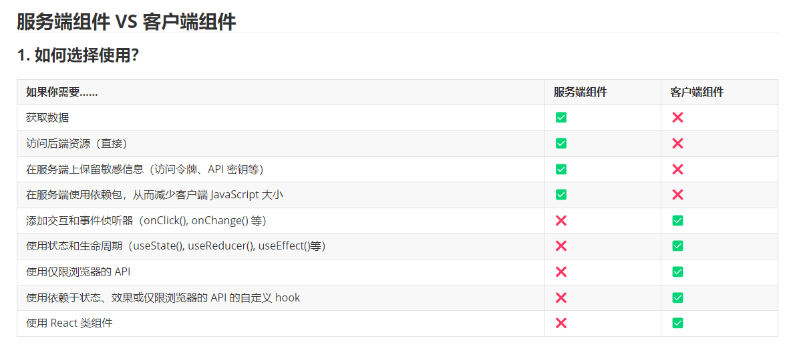
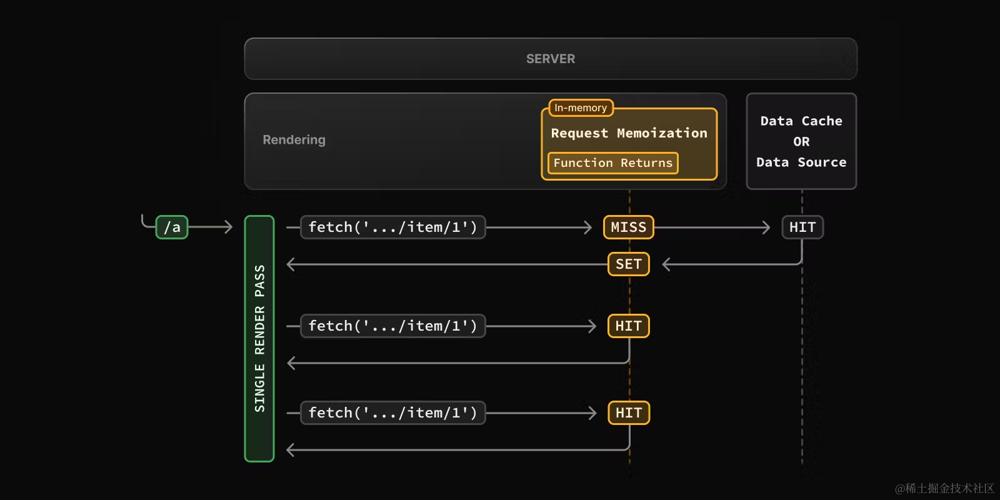
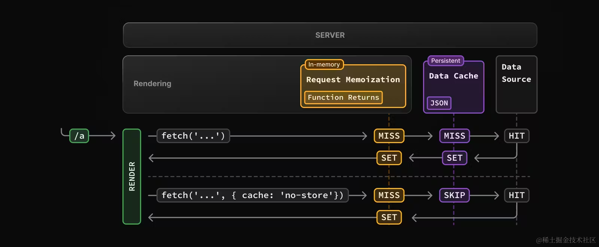

# 路由

## App Router

layout.js 和 template.js 都是用于页面布局的文件，但它们有不同的用途和实现方式。

layout.js

作用：layout.js 用于定义一个页面的布局，通常是整个页面的骨架（如页头、页脚、侧边栏等）。它是用于多页共享的布局组件。

使用场景：当多个页面需要共享相同的结构时（例如，所有页面都有相同的页头和页脚），你可以使用 layout.js 来实现。它是面向多个页面共享布局的。

特点：
通常用于定义全局布局。
可以通过嵌套的 layout.js 实现页面层级布局。
在 Next.js 13 中，layout.js 会包裹其子页面的内容。

template.js

作用：template.js 用于创建可复用的模板，通常在页面中需要不同内容的情况下使用。它允许你在不同的页面中动态插入不同的内容。

使用场景：适用于你需要重复使用某些结构，但是每次页面的内容不同的场景。template.js 通常用于插入特定的模板或布局。

特点：可以用于特定页面或某一部分的模板化。
更多地聚焦于局部页面结构，而不是全局布局。
比如可以创建一个页面模板，允许通过插槽或特定的参数来传递不同的内容。

通常情况下，如果你需要一个全局统一的布局，使用 layout.js；如果你需要在多个地方复用某种页面结构或模板，使用 template.js。

Next.js 基于文件系统的路由解决方案 App Router，介绍了用于定义页面的`page.js`、定义布局的`layout.js`、定义模板的`template.js`、定义加载界面的`loading.js`、定义错误处理的`error.js`、定义 404 页面的`not-found.js`。`template.js`、定义加载界面的`loading.js`、定义错误处理的`error.js`、定义 404 页面的`not-found.js`

```js
src/
└── app
    ├── page.js 
    ├── layout.js
    ├── template.js
    ├── loading.js
    ├── error.js
    └── not-found.js
    ├── about
    │   └── page.js
    └── more
        └── page.js
```
## 链接和导航

所谓“导航”，指的是使用 JavaScript 进行页面切换，通常会比浏览器默认的重新加载更快，因为在导航的时候，只会更新必要的组件，而不会重新加载整个页面。

在 Next.js 中，有 4 种方式可以实现路由导航：

1. **`<Link>` 组件**：用于客户端路由导航，支持预获取和动态渲染。
   - 基本用法：`<Link href="/dashboard">Dashboard</Link>`
   - 动态渲染：`<Link href={`/blog/${post.slug}`}>{post.title}</Link>`
   - 获取当前路径名：使用 `usePathname()` 获取当前 URL 路径。
   - 禁用滚动：`<Link href="/dashboard" scroll={false}>`

2. **`useRouter` Hook**：适用于客户端组件，用于更改路由。
   - 示例：`router.push('/dashboard')`

3. **`redirect` 函数**：适用于服务端组件，用于跳转到指定页面。
   - 示例：`redirect('/login')`

4. **History API**：使用浏览器原生的 `window.history.pushState` 和 `replaceState` 方法更新历史记录。
   - 示例：`window.history.pushState(null, '', '?sort=asc')`

## 动态路由  路由组  平行路由  拦截路由
1. 动态路由允许根据 URL 参数动态渲染不同的页面。通过文件和目录的命名方式来实现动态路由。

示例：
- 文件结构：
pages/ posts/ [id].js

```javascript
import { useRouter } from 'next/router';

const Post = () => {
  const router = useRouter();
  const { id } = router.query; // 获取动态参数 id
  return <h1>Post ID: {id}</h1>;
};

export default Post;
```
- 路由示例：
访问 /posts/1 或 /posts/xyz，页面根据 id 参数动态渲染。

2. 路由组 (Route Groups)
路由组是 Next.js 13 引入的特性，允许在 app 目录中将页面组织成不同的分组，增强代码拆分和布局管理。
```js
app/
  dashboard/
    page.js
  settings/
    page.js
```
路由示例：访问 /dashboard 和 /settings 时分别渲染对应的页面。

3. 平行路由 (Parallel Routes)
平行路由允许同一页面中根据不同的路由分支并行渲染不同的内容。
文件结构：
```
app/
  layout.js
  page.js
  dashboard/
    layout.js
    page.js
```
路由示例：
平行路由使页面在同一访问路径下分区域加载不同内容，例如，主页面和侧边栏内容分开加载。

4. 拦截路由 (Route Interception)
拦截路由允许你在页面加载前进行路由拦截，通常用于权限校验、用户认证等场景。

示例：
在 getServerSideProps 或 getInitialProps 中进行路由拦截。
可通过 middleware 配置拦截器，对用户请求进行权限判断和重定向。
```js
export async function getServerSideProps(context) {
  const user = await getUserFromSession(context.req);
  if (!user) {
    return {
      redirect: {
        destination: '/login',
        permanent: false,
      },
    };
  }
  return { props: { user } };
}
```

## CSR、SSR、SSG、ISR

**CSR，英文全称“Client-side Rendering”，中文翻译“客户端渲染”。顾名思义，渲染工作主要在客户端执行。**

像我们传统使用 React 的方式，就是客户端渲染。浏览器会先下载一个非常小的 HTML 文件和所需的  JavaScript 文件。在 JavaScript 中执行发送请求、获取数据、更新 DOM 和渲染页面等操作。

这样做最大的问题就是不够快。（SEO 问题是其次，现在的爬虫已经普遍能够支持 CSR 渲染的页面）

在下载、解析、执行 JavaScript以及请求数据没有返回前，页面不会完全呈现。

----

**SSR，英文全称“Server-side Rendering”，中文翻译“服务端渲染”。顾名思义，渲染工作主要在服务端执行。**

比如打开一篇博客文章页面，没有必要每次都让客户端请求，万一客户端网速不好呢，那干脆由服务端直接请求接口、获取数据，然后渲染成静态的 HTML 文件返回给用户。

虽然同样是发送请求，但通常服务端的环境（网络环境、设备性能）要好于客户端，所以最终的渲染速度（首屏加载时间）也会更快。

虽然总体速度是更快的，但因为 CSR 响应时只用返回一个很小的 HTML，SSR 响应还要请求接口，渲染 HTML，所以其响应时间会更长，对应到性能指标 TTFB (Time To First Byte)，SSR 更长。

----

**SSG，英文全称“Static Site Generation”，中文翻译“静态站点生成”。**

SSG 会在构建阶段，就将页面编译为静态的 HTML 文件。

比如打开一篇博客文章页面，既然所有人看到的内容都是一样的，没有必要在用户请求页面的时候，服务端再请求接口。干脆先获取数据，提前编译成 HTML 文件，等用户访问的时候，直接返回 HTML 文件。这样速度会更快。再配上 CDN 缓存，速度就更快了。

所以能用 SSG 就用 SSG。“在用户访问之前是否能预渲染出来？”如果能，就用 SSG。

----- 

**ISR，英文全称“Incremental Static Regeneration”，中文翻译“增量静态再生”。**
还是打开一篇博客文章页面，博客的主体内容也许是不变的，但像比如点赞、收藏这些数据总是在变化的吧。使用 SSG 编译成 HTML 文件后，这些数据就无法准确获取了，那你可能就退而求其次改为 SSR 或者 CSR 了。

考虑到这种情况，Next.js 提出了 ISR。当用户访问了这个页面，第一次依然是老的 HTML 内容，但是 Next.js 同时静态编译成新的 HTML 文件，当你第二次访问或者其他用户访问的时候，就会变成新的 HTML 内容了。可以在[新 demo](https://on-demand-isr.vercel.app/) 中测试 ISR 效果。

---- 

**支持混合使用**

在写 demo 的时候，想必你已经发现了，其实每个页面你并没有专门声明使用哪种渲染模式，Next.js 是自动判断的。所以一个 Next.js 应用里支持混合使用多种渲染模式。

当页面有 `getServerSideProps`的时候，Next.js 切成 SSR 模式。没有 `getServerSideProps` 则会预渲染页面为静态的 HTML。那你可能会问，CSR 呢？就算用 CSR 模式，Next.js 也要提供一个静态的 HTML，所以还是要走预渲染这步的，只不过相比 SSG，渲染的内容少了些。

页面可以是 SSG + CSR 的混合，由 SSG 提供初始的静态页面，提高首屏加载速度。CSR 动态填充内容，提供交互能力。举个例子:

```js
// pages/postList.js
import React, { useState } from 'react'

export default function Blog({ posts }) {
  const [data, setData] = useState(posts)
  return (
    <>
      <button onClick={async () => {
          const res = await fetch('https://jsonplaceholder.typicode.com/posts')
          const posts = await res.json()
          setData(posts.slice(10, 20))
      }}>换一批</button>
      <ul>
        {data.map((post) => (
          <li key={post.id}>{post.title}</li>
        ))}
      </ul>
    </>
  )
}

export async function getStaticProps() {
  const res = await fetch('https://jsonplaceholder.typicode.com/posts')
  const posts = await res.json()
  return {
    props: {
      posts: posts.slice(0, 10),
    },
  }
}
```

### 服务端渲染

1.  数据获取：通常服务端环境（网络、性能等）更好，离数据源更近，在服务端获取数据会更快。通过减少数据加载时间以及客户端发出的请求数量来提高性能
2.  安全：在服务端保留敏感数据和逻辑，不用担心暴露给客户端
3.  缓存：服务端渲染的结果可以在后续的请求中复用，提高性能
4.  bundle 大小：服务端组件的代码不会打包到 bundle 中，减少了 bundle 包的大小
5.  初始页面加载和 FCP：服务端渲染生成 HTML，快速展示 UI
6.  Streaming：服务端组件可以将渲染工作拆分为 chunks，并在准备就绪时将它们流式传输到客户端。用户可以更早看到页面的部分内容，而不必等待整个页面渲染完毕

因为服务端组件的诸多好处，**在实际项目开发的时候，能使用服务端组件就尽可能使用服务端组件**。

**限制**：虽然使用服务端组件有很多好处，但使用服务端组件也有一些限制，比如不能使用 useState 管理状态，不能使用浏览器的 API 等等。如果我们使用了 Next.js 会报错。所以在使用服务端组件的时候，需要注意这些限制，以免出错。

### 客户端渲染

1.  交互性：客户端组件可以使用 state、effects 和事件监听器，意味着用户可以与之交互
2.  浏览器 API：客户端组件可以使用浏览器 API 如地理位置、localStorage 等



#### 交替使用服务端组件和客户端组件

实际开发的时候，不可能纯用服务端组件或者客户端组件，当交替使用的时候，一定要注意一点，那就是：

**服务端组件可以直接导入客户端组件，但客户端组件并不能导入服务端组件**

组件默认是服务端组件，但当组件导入到客户端组件中会被认为是客户端组件。客户端组件不能导入服务端组件，其实是在告诉你，如果你在服务端组件中使用了诸如 Node API 等，该组件可千万不要导入到客户端组件中。

但你可以将服务端组件以 props 的形式传给客户端组件：

```js
'use client'
 
import { useState } from 'react'
 
export default function ClientComponent({ children }) {
  const [count, setCount] = useState(0)
 
  return (
    <>
      <button onClick={() => setCount(count + 1)}>{count}</button>
      {children}
    </>
  )
}
```
```js
import ClientComponent from './client-component'
import ServerComponent from './server-component'
 
export default function Page() {
  return (
    <ClientComponent>
      <ServerComponent />
    </ClientComponent>
  )
}
```
使用这种方式，`<ClientComponent>` 和 `<ServerComponent>` 代码解耦且独立渲染。

### 组件渲染原理
在服务端：

Next.js 使用 React API 编排渲染，渲染工作会根据路由和 Suspense 拆分成多个块（chunks），每个块分两步进行渲染：

1.  React 将服务端组件渲染成一个特殊的数据格式称为 **React Server Component Payload (RSC Payload)**
2.  Next.js 使用 RSC Payload 和客户端组件代码在服务端渲染 HTML

> RSC payload 中包含如下这些信息：
>
> 1.  服务端组件的渲染结果
> 2.  客户端组件占位符和引用文件
> 3.  从服务端组件传给客户端组件的数据

在客户端：

1.  加载渲染的 HTML 快速展示一个非交互界面（Non-interactive UI）
2.  RSC Payload 会被用于协调（reconcile）客户端和服务端组件树，并更新 DOM
3.  JavaScript 代码被用于水合客户端组件，使应用程序具有交互性（Interactive UI）


### 服务端渲染策略

Next.js 存在三种不同的服务端渲染策略：

*   静态渲染
*   动态渲染
*   Streaming

我们来一一介绍。

1. 静态渲染（Static Rendering）

**这是默认渲染策略**，**路由在构建时渲染，或者在重新验证后后台渲染**，其结果会被缓存并且可以推送到 CDN。适用于未针对用户个性化且数据已知的情况，比如静态博客文章、产品介绍页面等。

2. 动态渲染（Dynamic Rendering）

路由在请求时渲染，适用于针对用户个性化或依赖请求中的信息（如 cookie、URL 参数）的情况。

在渲染过程中，**如果使用了动态函数（Dynamic functions）或者未缓存的数据请求（uncached data request），Next.js 就会切换为动态渲染**。作为开发者，无须选择静态还是动态渲染，Next.js 会自动根据使用的功能和 API 为每个路由选择最佳的渲染策略

#### 使用动态函数（Dynamic functions）

**动态函数指的是获取只有在请求时才能得到信息（如 cookie、请求头、URL 参数）的函数**。

在 Next.js 中这些动态函数是：

*   [cookies()](https://juejin.cn/book/7307859898316881957/section/7309079651500949530#heading-7) 和 [headers()](https://juejin.cn/book/7307859898316881957/section/7309079651500949530#heading-20) ：获取 cookie 和 header
*   `searchParams`：页面查询参数

使用这些函数的任意一个，都会导致路由转为动态渲染。


#### 使用未缓存的数据请求（uncached data request）

在 Next.js 中，fetch 请求的结果默认会被缓存，但你可以设置退出缓存，一旦你设置了退出缓存，就意味着使用了未缓存的数据请求（uncached data request），会导致路由进入动态渲染，如：

*   `fetch` 请求添加了 `cache: 'no-store'`选项
*   `fetch` 请求添加了 `revalidate: 0`选项
*   `fetch` 请求在路由处理程序中并使用了 `POST` 方法
*   在`headers` 或 `cookies` 方法之后使用 `fetch`请求
*   配置了路由段选项 `const dynamic = 'force-dynamic'`
*   配置了路由段选项`fetchCache` ，默认会跳过缓存
*   `fetch` 请求使用了 `Authorization`或者 `Cookie`请求头，并且在组件树中其上方还有一个未缓存的请求

####  局部渲染（Partial rendering）

局部渲染指的是仅在客户端重新渲染导航时更改的路由段，共享段的内容的继续保留。举个例子，当在两个相邻的路由间导航的时候, `/dashboard/settings` 和 `/dashboard/analytics`，`settings` 和 `analytics` 页面会重新渲染，共享的 `dashboard` 布局会保留。


## 数据获取

在 Next.js 中获取数据的推荐方式是使用原生的 `fetch` 方法，因为 Next.js 扩展了 `fetch` 方法，增加了缓存和重新验证机制。

### 服务端使用 `fetch`


Next.js 扩展了原生的 [fetch Web API](https://developer.mozilla.org/zh-CN/docs/Web/API/Fetch_API)，可以为服务端的每个请求配置缓存和重新验证行为。

```javascript
// app/page.js
async function getData() {
  const res = await fetch('https://jsonplaceholder.typicode.com/todos') 
  if (!res.ok) {
    throw new Error('Failed to fetch data')
  }
  return res.json()
}

export default async function Page() {
  const data = await getData()
  return <main>{JSON.stringify(data)}</main>
}
```

### 默认缓存

默认情况下，Next.js 会自动缓存服务端 `fetch` 请求的返回值。

```javascript
// fetch 的 cache 选项用于控制该请求的缓存行为
fetch('https://...&#39;,  { cache: 'force-cache' })
```

### 重新验证

Next.js 提供了两种方式重新验证：基于时间的重新验证和按需重新验证。

#### 基于时间的重新验证

```javascript
fetch('https://...&#39;,  { next: { revalidate: 3600 } })
```

#### 按需重新验证

- revalidatePath

```javascript
import { revalidatePath } from 'next/cache'
 
export async function GET(request) {
  const path = request.nextUrl.searchParams.get('path')
 
  if (path) {
    revalidatePath(path)
    return Response.json({ revalidated: true, now: Date.now() })
  }
 
  return Response.json({
    revalidated: false,
    now: Date.now(),
    message: 'Missing path to revalidate',
  })
}
```

- revalidateTag

```javascript
// app/page.js
export default async function Page() {
  const res = await fetch('https://...&#39;,  { next: { tags: ['collection'] } })
  const data = await res.json()
  // ...
}
```

### 服务端使用三方请求库

如果使用不支持 `fetch` 的三方库，可以使用 React 的 `cache` 函数和路由段配置项来实现请求的缓存和重新验证。

```javascript
// app/utils.js
import { cache } from 'react'
 
export const getItem = cache(async (id) => {
  const item = await db.item.findUnique({ id })
  return item
})
```

### 客户端使用路由处理程序

在客户端组件中获取数据，可以在客户端调用路由处理程序。路由处理程序会在服务端被执行，然后将数据返回给客户端。

### 客户端使用三方请求库

在客户端使用三方库如 [SWR](https://swr.vercel.app/) 或 [React Query](https://tanstack.com/query/latest) 来获取数据。

### 建议与最佳实践

#### 5.1. 尽可能在服务端获取数据

尽可能在服务端获取数据，这样做有很多好处，比如：

1.  可以直接访问后端资源（如数据库）
2.  防止敏感信息泄漏
3.  减少客户端和服务端之间的来回通信，加快响应时间

#### 5.2. 在需要的地方就地获取数据

如果组件树中的多个组件使用相同的数据，无须先全局获取，再通过 props 传递，你可以直接在需要的地方使用 `fetch` 或者 React `cache` 获取数据，不用担心多次请求造成的性能问题，因为 `fetch` 请求会自动被记忆化。这也同样适用于布局，毕竟本来父子布局之间也不能传递数据。

#### 5.3. 适当的时候使用 Streaming

Streaming 和 `Suspense`都是 React 的功能，允许你增量传输内容以及渐进式渲染 UI 单元。页面可以直接渲染部分内容，剩余获取数据的部分会展示加载态，这也意味着用户不需要等到页面完全加载完才能与其交互。

#### 5.4. 串行获取数据

在 React 组件内获取数据时，有两种数据获取模式，并行和串行。

#### 5.5. 并行数据请求

要实现并行请求数据，你可以在使用数据的组件外定义请求，然后在组件内部调用。

#### 5.6. 预加载数据

防止出现串行请求的另外一种方式是使用预加载。

#### 5.7. 使用 React `cache` `server-only` 和预加载模式

你可以将 `cache` 函数，`preload` 模式和 [server-only](https://juejin.cn/book/7307859898316881957/section/7309076661532622885#heading-15) 包一起使用，创建一个可在整个应用使用的数据请求工具函数。

## 缓存 Caching

Next.js 中有四种缓存机制：

| 机制                             | 缓存内容            | 存储地方 | 目的                      | 期间               |
| -------------------------------- | ------------------- | -------- | ------------------------- | ------------------ |
| 请求记忆（Request Memoization）  | 函数返回值          | 服务端   | 在 React 组件树中复用数据 | 每个请求的生命周期 |
| 数据缓存（Data Cache ）          | 数据                | 服务端   | 跨用户请求和部署复用数据  | 持久（可重新验证） |
| 完整路由缓存（Full Route Cache） | HTML 和 RSC payload | 服务端   | 降低渲染成本、提高性能    | 持久（可重新验证） |
| 路由缓存（Router Cache）         | RSC payload         | 客户端   | 减少导航时的服务端请求    | 用户会话或基于时间 |

### 请求记忆

React 拓展了 [fetch API](https://nextjs.org/docs/app/building-your-application/caching#fetch)，当有相同的 URL 和参数的时候，React 会自动将请求结果缓存。也就是说，即时你在组件树中的多个位置请求一份相同的数据，但数据获取只会执行一次。
这样当你跨路由（比如跨布局、页面、组件）时，你不需要在顶层请求数据，然后将返回结果通过 props 转发，直接在需要数据的组件中请求数据即可，不用担心对同一数据发出多次请求造成的性能影响。

在这种图中，当渲染 `/a` 路由的时候，由于是第一次请求，会触发缓存 `MISS`，函数被执行，请求结果会被存储到内存中（缓存`SET`），当下一次相同的调用发生时，会触发缓存 `HIT`，数据直接从内存中取出。

关于请求记忆，要注意：

*   请求记忆是 React 的特性，并非 Next.js 的特性。 React 和 Next.js 都做了请求缓存，React 的方案叫做“请求记忆”，Next.js 的方案叫做“数据缓存”，两者有很多不同
*   请求记忆只适合用于用 `GET` 方法的 `fetch` 请求
*   请求记忆只应用于 React 组件树，也就是说你在 `generateMetadata`、`generateStaticParams`、布局、页面和其他服务端组件中使用 fetch 会触发请求记忆，但是在路由处理程序中使用则不会触发，因为这就不在 React 组件树中了。

### 数据缓存
Next.js 有自己的数据缓存方案，可以跨服务端请求和构建部署存储数据。之所以能够实现，是因为 Next.js 拓展了 fetch API，在 Next.js 中，每个请求都可以设置自己的缓存方式。

不过与 React 的请求记忆不同的是，请求记忆因为只用于组件树渲染的时候，所以不用考虑数据缓存更新的情况，但 Next.js 的数据缓存方案更为持久，则需要考虑这个问题。

默认情况下，使用 `fetch` 的数据请求都会被缓存，这个缓存是持久的，它不会自动被重置。你可以使用 `fetch` 的 `cache` 和 `next.revalidate` 选项来配置缓存行为：

```
fetch(`https://...`, { cache: 'force-cache' | 'no-store' })
fetch(`https://...`, { next: { revalidate: 3600 } })
```

让我们解释一下：当渲染的时候首次调用，请求记忆和数据缓存都会 MISS，从而执行请求，返回的结果在请求记忆和数据缓存中都会存储一份。

当再次调用的时候，因为添加了 `{cache: 'no-store'}`参数，请求参数不同，请求记忆会  MISS，而这个参数会导致数据缓存跳过，所以依然是执行请求，因为配置了 no-store，所以数据缓存也不会缓存返回的结果，请求记忆则会正常做缓存处理。