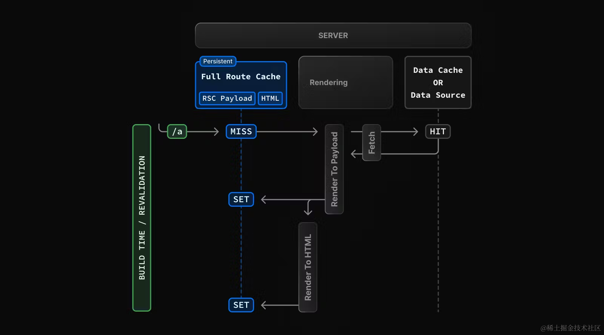
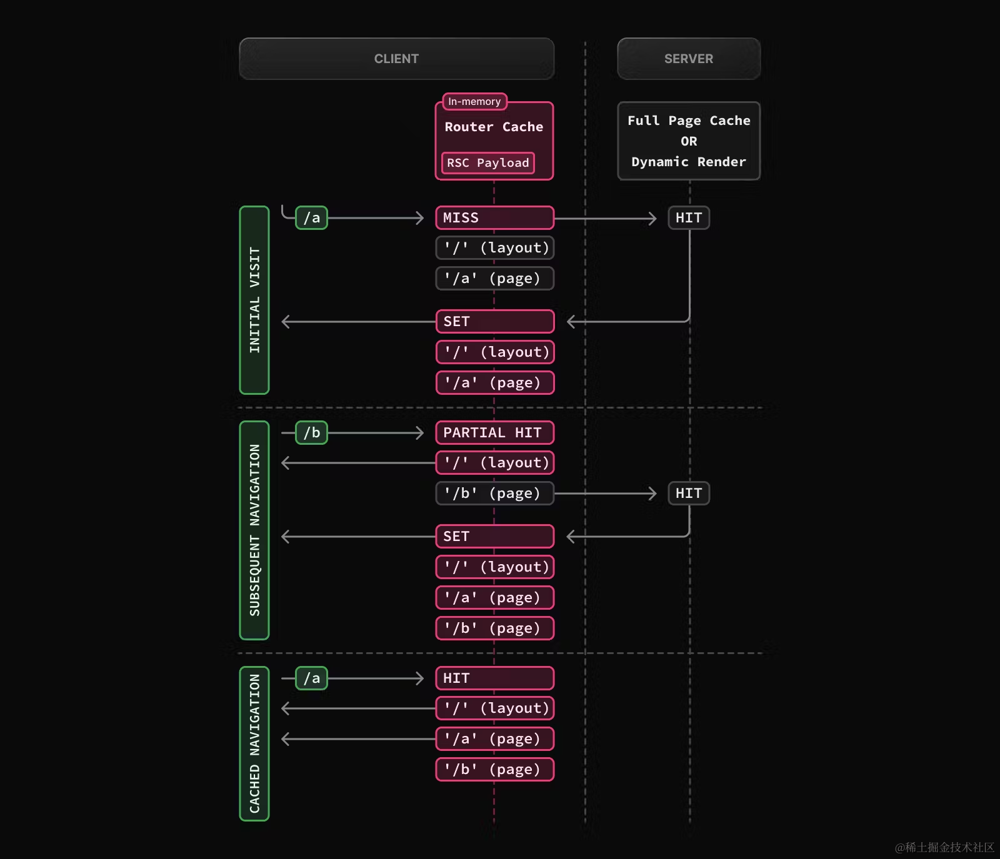
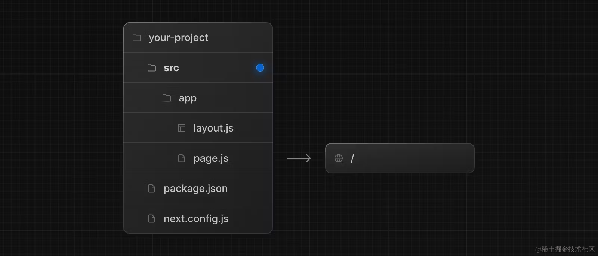

# 路由

## App Router

layout.js 和 template.js 都是用于页面布局的文件，但它们有不同的用途和实现方式。

layout.js

作用：layout.js 用于定义一个页面的布局，通常是整个页面的骨架（如页头、页脚、侧边栏等）。它是用于多页共享的布局组件。

使用场景：当多个页面需要共享相同的结构时（例如，所有页面都有相同的页头和页脚），你可以使用 layout.js 来实现。它是面向多个页面共享布局的。

特点：
通常用于定义全局布局。
可以通过嵌套的 layout.js 实现页面层级布局。
在 Next.js 13 中，layout.js 会包裹其子页面的内容。

template.js

作用：template.js 用于创建可复用的模板，通常在页面中需要不同内容的情况下使用。它允许你在不同的页面中动态插入不同的内容。

使用场景：适用于你需要重复使用某些结构，但是每次页面的内容不同的场景。template.js 通常用于插入特定的模板或布局。

特点：可以用于特定页面或某一部分的模板化。
更多地聚焦于局部页面结构，而不是全局布局。
比如可以创建一个页面模板，允许通过插槽或特定的参数来传递不同的内容。

通常情况下，如果你需要一个全局统一的布局，使用 layout.js；如果你需要在多个地方复用某种页面结构或模板，使用 template.js。

Next.js 基于文件系统的路由解决方案 App Router，介绍了用于定义页面的`page.js`、定义布局的`layout.js`、定义模板的`template.js`、定义加载界面的`loading.js`、定义错误处理的`error.js`、定义 404 页面的`not-found.js`。`template.js`、定义加载界面的`loading.js`、定义错误处理的`error.js`、定义 404 页面的`not-found.js`

```js
src/
└── app
    ├── page.js
    ├── layout.js
    ├── template.js
    ├── loading.js
    ├── error.js
    └── not-found.js
    ├── about
    │   └── page.js
    └── more
        └── page.js
```

## 链接和导航

所谓“导航”，指的是使用 JavaScript 进行页面切换，通常会比浏览器默认的重新加载更快，因为在导航的时候，只会更新必要的组件，而不会重新加载整个页面。

在 Next.js 中，有 4 种方式可以实现路由导航：

1. **`<Link>` 组件**：用于客户端路由导航，支持预获取和动态渲染。

   - 基本用法：`<Link href="/dashboard">Dashboard</Link>`
   - 动态渲染：`<Link href={`/blog/${post.slug}`}>{post.title}</Link>`
   - 获取当前路径名：使用 `usePathname()` 获取当前 URL 路径。
   - 禁用滚动：`<Link href="/dashboard" scroll={false}>`

2. **`useRouter` Hook**：适用于客户端组件，用于更改路由。

   - 示例：`router.push('/dashboard')`

3. **`redirect` 函数**：适用于服务端组件，用于跳转到指定页面。

   - 示例：`redirect('/login')`

4. **History API**：使用浏览器原生的 `window.history.pushState` 和 `replaceState` 方法更新历史记录。
   - 示例：`window.history.pushState(null, '', '?sort=asc')`

## 动态路由 路由组 平行路由 拦截路由

1. 动态路由允许根据 URL 参数动态渲染不同的页面。通过文件和目录的命名方式来实现动态路由。

示例：

- 文件结构：
  pages/ posts/ [id].js

```javascript
import { useRouter } from 'next/router'

const Post = () => {
  const router = useRouter()
  const { id } = router.query // 获取动态参数 id
  return <h1>Post ID: {id}</h1>
}

export default Post
```

- 路由示例：
  访问 /posts/1 或 /posts/xyz，页面根据 id 参数动态渲染。

2. 路由组 (Route Groups)
   路由组是 Next.js 13 引入的特性，允许在 app 目录中将页面组织成不同的分组，增强代码拆分和布局管理。

```js
app / dashboard / page.js
settings / page.js
```

路由示例：访问 /dashboard 和 /settings 时分别渲染对应的页面。

3. 平行路由 (Parallel Routes)
   平行路由允许同一页面中根据不同的路由分支并行渲染不同的内容。
   文件结构：

```
app/
  layout.js
  page.js
  dashboard/
    layout.js
    page.js
```

路由示例：
平行路由使页面在同一访问路径下分区域加载不同内容，例如，主页面和侧边栏内容分开加载。

4. 拦截路由 (Route Interception)
   拦截路由允许你在页面加载前进行路由拦截，通常用于权限校验、用户认证等场景。

示例：
在 getServerSideProps 或 getInitialProps 中进行路由拦截。
可通过 middleware 配置拦截器，对用户请求进行权限判断和重定向。

```js
export async function getServerSideProps(context) {
  const user = await getUserFromSession(context.req)
  if (!user) {
    return {
      redirect: {
        destination: '/login',
        permanent: false,
      },
    }
  }
  return { props: { user } }
}
```

## CSR、SSR、SSG、ISR

**CSR，英文全称“Client-side Rendering”，中文翻译“客户端渲染”。顾名思义，渲染工作主要在客户端执行。**

像我们传统使用 React 的方式，就是客户端渲染。浏览器会先下载一个非常小的 HTML 文件和所需的 JavaScript 文件。在 JavaScript 中执行发送请求、获取数据、更新 DOM 和渲染页面等操作。

这样做最大的问题就是不够快。（SEO 问题是其次，现在的爬虫已经普遍能够支持 CSR 渲染的页面）

在下载、解析、执行 JavaScript 以及请求数据没有返回前，页面不会完全呈现。

---

**SSR，英文全称“Server-side Rendering”，中文翻译“服务端渲染”。顾名思义，渲染工作主要在服务端执行。**

比如打开一篇博客文章页面，没有必要每次都让客户端请求，万一客户端网速不好呢，那干脆由服务端直接请求接口、获取数据，然后渲染成静态的 HTML 文件返回给用户。

虽然同样是发送请求，但通常服务端的环境（网络环境、设备性能）要好于客户端，所以最终的渲染速度（首屏加载时间）也会更快。

虽然总体速度是更快的，但因为 CSR 响应时只用返回一个很小的 HTML，SSR 响应还要请求接口，渲染 HTML，所以其响应时间会更长，对应到性能指标 TTFB (Time To First Byte)，SSR 更长。

---

**SSG，英文全称“Static Site Generation”，中文翻译“静态站点生成”。**

SSG 会在构建阶段，就将页面编译为静态的 HTML 文件。

比如打开一篇博客文章页面，既然所有人看到的内容都是一样的，没有必要在用户请求页面的时候，服务端再请求接口。干脆先获取数据，提前编译成 HTML 文件，等用户访问的时候，直接返回 HTML 文件。这样速度会更快。再配上 CDN 缓存，速度就更快了。

所以能用 SSG 就用 SSG。“在用户访问之前是否能预渲染出来？”如果能，就用 SSG。

---

**ISR，英文全称“Incremental Static Regeneration”，中文翻译“增量静态再生”。**
还是打开一篇博客文章页面，博客的主体内容也许是不变的，但像比如点赞、收藏这些数据总是在变化的吧。使用 SSG 编译成 HTML 文件后，这些数据就无法准确获取了，那你可能就退而求其次改为 SSR 或者 CSR 了。

考虑到这种情况，Next.js 提出了 ISR。当用户访问了这个页面，第一次依然是老的 HTML 内容，但是 Next.js 同时静态编译成新的 HTML 文件，当你第二次访问或者其他用户访问的时候，就会变成新的 HTML 内容了。可以在[新 demo](https://on-demand-isr.vercel.app/) 中测试 ISR 效果。

---

**支持混合使用**

在写 demo 的时候，想必你已经发现了，其实每个页面你并没有专门声明使用哪种渲染模式，Next.js 是自动判断的。所以一个 Next.js 应用里支持混合使用多种渲染模式。

当页面有 `getServerSideProps`的时候，Next.js 切成 SSR 模式。没有 `getServerSideProps` 则会预渲染页面为静态的 HTML。那你可能会问，CSR 呢？就算用 CSR 模式，Next.js 也要提供一个静态的 HTML，所以还是要走预渲染这步的，只不过相比 SSG，渲染的内容少了些。

页面可以是 SSG + CSR 的混合，由 SSG 提供初始的静态页面，提高首屏加载速度。CSR 动态填充内容，提供交互能力。举个例子:

```js
// pages/postList.js
import React, { useState } from 'react'

export default function Blog({ posts }) {
  const [data, setData] = useState(posts)
  return (
    <>
      <button
        onClick={async () => {
          const res = await fetch('https://jsonplaceholder.typicode.com/posts')
          const posts = await res.json()
          setData(posts.slice(10, 20))
        }}
      >
        换一批
      </button>
      <ul>
        {data.map((post) => (
          <li key={post.id}>{post.title}</li>
        ))}
      </ul>
    </>
  )
}

export async function getStaticProps() {
  const res = await fetch('https://jsonplaceholder.typicode.com/posts')
  const posts = await res.json()
  return {
    props: {
      posts: posts.slice(0, 10),
    },
  }
}
```

### 服务端渲染

1.  数据获取：通常服务端环境（网络、性能等）更好，离数据源更近，在服务端获取数据会更快。通过减少数据加载时间以及客户端发出的请求数量来提高性能
2.  安全：在服务端保留敏感数据和逻辑，不用担心暴露给客户端
3.  缓存：服务端渲染的结果可以在后续的请求中复用，提高性能
4.  bundle 大小：服务端组件的代码不会打包到 bundle 中，减少了 bundle 包的大小
5.  初始页面加载和 FCP：服务端渲染生成 HTML，快速展示 UI
6.  Streaming：服务端组件可以将渲染工作拆分为 chunks，并在准备就绪时将它们流式传输到客户端。用户可以更早看到页面的部分内容，而不必等待整个页面渲染完毕

因为服务端组件的诸多好处，**在实际项目开发的时候，能使用服务端组件就尽可能使用服务端组件**。

**限制**：虽然使用服务端组件有很多好处，但使用服务端组件也有一些限制，比如不能使用 useState 管理状态，不能使用浏览器的 API 等等。如果我们使用了 Next.js 会报错。所以在使用服务端组件的时候，需要注意这些限制，以免出错。

### 客户端渲染

1.  交互性：客户端组件可以使用 state、effects 和事件监听器，意味着用户可以与之交互
2.  浏览器 API：客户端组件可以使用浏览器 API 如地理位置、localStorage 等


#### 交替使用服务端组件和客户端组件

实际开发的时候，不可能纯用服务端组件或者客户端组件，当交替使用的时候，一定要注意一点，那就是：

**服务端组件可以直接导入客户端组件，但客户端组件并不能导入服务端组件**

组件默认是服务端组件，但当组件导入到客户端组件中会被认为是客户端组件。客户端组件不能导入服务端组件，其实是在告诉你，如果你在服务端组件中使用了诸如 Node API 等，该组件可千万不要导入到客户端组件中。

但你可以将服务端组件以 props 的形式传给客户端组件：

```js
'use client'

import { useState } from 'react'

export default function ClientComponent({ children }) {
  const [count, setCount] = useState(0)

  return (
    <>
      <button onClick={() => setCount(count + 1)}>{count}</button>
      {children}
    </>
  )
}
```

```js
import ClientComponent from './client-component'
import ServerComponent from './server-component'

export default function Page() {
  return (
    <ClientComponent>
      <ServerComponent />
    </ClientComponent>
  )
}
```

使用这种方式，`<ClientComponent>` 和 `<ServerComponent>` 代码解耦且独立渲染。

### 组件渲染原理

在服务端：

Next.js 使用 React API 编排渲染，渲染工作会根据路由和 Suspense 拆分成多个块（chunks），每个块分两步进行渲染：

1.  React 将服务端组件渲染成一个特殊的数据格式称为 **React Server Component Payload (RSC Payload)**
2.  Next.js 使用 RSC Payload 和客户端组件代码在服务端渲染 HTML

> RSC payload 中包含如下这些信息：
>
> 1.  服务端组件的渲染结果
> 2.  客户端组件占位符和引用文件
> 3.  从服务端组件传给客户端组件的数据

在客户端：

1.  加载渲染的 HTML 快速展示一个非交互界面（Non-interactive UI）
2.  RSC Payload 会被用于协调（reconcile）客户端和服务端组件树，并更新 DOM
3.  JavaScript 代码被用于水合客户端组件，使应用程序具有交互性（Interactive UI）

### 服务端渲染策略

Next.js 存在三种不同的服务端渲染策略：

- 静态渲染
- 动态渲染
- Streaming

我们来一一介绍。

1. 静态渲染（Static Rendering）

**这是默认渲染策略**，**路由在构建时渲染，或者在重新验证后后台渲染**，其结果会被缓存并且可以推送到 CDN。适用于未针对用户个性化且数据已知的情况，比如静态博客文章、产品介绍页面等。

2. 动态渲染（Dynamic Rendering）

路由在请求时渲染，适用于针对用户个性化或依赖请求中的信息（如 cookie、URL 参数）的情况。

在渲染过程中，**如果使用了动态函数（Dynamic functions）或者未缓存的数据请求（uncached data request），Next.js 就会切换为动态渲染**。作为开发者，无须选择静态还是动态渲染，Next.js 会自动根据使用的功能和 API 为每个路由选择最佳的渲染策略

#### 使用动态函数（Dynamic functions）

**动态函数指的是获取只有在请求时才能得到信息（如 cookie、请求头、URL 参数）的函数**。

在 Next.js 中这些动态函数是：

- [cookies()](https://juejin.cn/book/7307859898316881957/section/7309079651500949530#heading-7) 和 [headers()](https://juejin.cn/book/7307859898316881957/section/7309079651500949530#heading-20) ：获取 cookie 和 header
- `searchParams`：页面查询参数

使用这些函数的任意一个，都会导致路由转为动态渲染。

#### 使用未缓存的数据请求（uncached data request）

在 Next.js 中，fetch 请求的结果默认会被缓存，但你可以设置退出缓存，一旦你设置了退出缓存，就意味着使用了未缓存的数据请求（uncached data request），会导致路由进入动态渲染，如：

- `fetch` 请求添加了 `cache: 'no-store'`选项
- `fetch` 请求添加了 `revalidate: 0`选项
- `fetch` 请求在路由处理程序中并使用了 `POST` 方法
- 在`headers` 或 `cookies` 方法之后使用 `fetch`请求
- 配置了路由段选项 `const dynamic = 'force-dynamic'`
- 配置了路由段选项`fetchCache` ，默认会跳过缓存
- `fetch` 请求使用了 `Authorization`或者 `Cookie`请求头，并且在组件树中其上方还有一个未缓存的请求

#### 局部渲染（Partial rendering）

局部渲染指的是仅在客户端重新渲染导航时更改的路由段，共享段的内容的继续保留。举个例子，当在两个相邻的路由间导航的时候, `/dashboard/settings` 和 `/dashboard/analytics`，`settings` 和 `analytics` 页面会重新渲染，共享的 `dashboard` 布局会保留。

## 数据获取

在 Next.js 中获取数据的推荐方式是使用原生的 `fetch` 方法，因为 Next.js 扩展了 `fetch` 方法，增加了缓存和重新验证机制。

### 服务端使用 `fetch`

Next.js 扩展了原生的 [fetch Web API](https://developer.mozilla.org/zh-CN/docs/Web/API/Fetch_API)，可以为服务端的每个请求配置缓存和重新验证行为。

```javascript
// app/page.js
async function getData() {
  const res = await fetch('https://jsonplaceholder.typicode.com/todos')
  if (!res.ok) {
    throw new Error('Failed to fetch data')
  }
  return res.json()
}

export default async function Page() {
  const data = await getData()
  return <main>{JSON.stringify(data)}</main>
}
```

### 默认缓存

默认情况下，Next.js 会自动缓存服务端 `fetch` 请求的返回值。

```javascript
// fetch 的 cache 选项用于控制该请求的缓存行为
fetch('https://...&#39;,  { cache: 'force-cache' })
```

### 重新验证

Next.js 提供了两种方式重新验证：基于时间的重新验证和按需重新验证。

#### 基于时间的重新验证

```javascript
fetch('https://...&#39;,  { next: { revalidate: 3600 } })
```

#### 按需重新验证

- revalidatePath

```javascript
import { revalidatePath } from 'next/cache'

export async function GET(request) {
  const path = request.nextUrl.searchParams.get('path')

  if (path) {
    revalidatePath(path)
    return Response.json({ revalidated: true, now: Date.now() })
  }

  return Response.json({
    revalidated: false,
    now: Date.now(),
    message: 'Missing path to revalidate',
  })
}
```

- revalidateTag

```javascript
// app/page.js
export default async function Page() {
  const res = await fetch('https://...&#39;,  { next: { tags: ['collection'] } })
  const data = await res.json()
  // ...
}
```

### 服务端使用三方请求库

如果使用不支持 `fetch` 的三方库，可以使用 React 的 `cache` 函数和路由段配置项来实现请求的缓存和重新验证。

```javascript
// app/utils.js
import { cache } from 'react'

export const getItem = cache(async (id) => {
  const item = await db.item.findUnique({ id })
  return item
})
```

### 客户端使用路由处理程序

在客户端组件中获取数据，可以在客户端调用路由处理程序。路由处理程序会在服务端被执行，然后将数据返回给客户端。

### 客户端使用三方请求库

在客户端使用三方库如 [SWR](https://swr.vercel.app/) 或 [React Query](https://tanstack.com/query/latest) 来获取数据。

### 建议与最佳实践

#### 5.1. 尽可能在服务端获取数据

尽可能在服务端获取数据，这样做有很多好处，比如：

1.  可以直接访问后端资源（如数据库）
2.  防止敏感信息泄漏
3.  减少客户端和服务端之间的来回通信，加快响应时间

#### 5.2. 在需要的地方就地获取数据

如果组件树中的多个组件使用相同的数据，无须先全局获取，再通过 props 传递，你可以直接在需要的地方使用 `fetch` 或者 React `cache` 获取数据，不用担心多次请求造成的性能问题，因为 `fetch` 请求会自动被记忆化。这也同样适用于布局，毕竟本来父子布局之间也不能传递数据。

#### 5.3. 适当的时候使用 Streaming

Streaming 和 `Suspense`都是 React 的功能，允许你增量传输内容以及渐进式渲染 UI 单元。页面可以直接渲染部分内容，剩余获取数据的部分会展示加载态，这也意味着用户不需要等到页面完全加载完才能与其交互。

#### 5.4. 串行获取数据

在 React 组件内获取数据时，有两种数据获取模式，并行和串行。

#### 5.5. 并行数据请求

要实现并行请求数据，你可以在使用数据的组件外定义请求，然后在组件内部调用。

#### 5.6. 预加载数据

防止出现串行请求的另外一种方式是使用预加载。

#### 5.7. 使用 React `cache` `server-only` 和预加载模式

你可以将 `cache` 函数，`preload` 模式和 [server-only](https://juejin.cn/book/7307859898316881957/section/7309076661532622885#heading-15) 包一起使用，创建一个可在整个应用使用的数据请求工具函数。

## 缓存 Caching

Next.js 中有四种缓存机制：

| 机制                             | 缓存内容            | 存储地方 | 目的                      | 期间               |
| -------------------------------- | ------------------- | -------- | ------------------------- | ------------------ |
| 请求记忆（Request Memoization）  | 函数返回值          | 服务端   | 在 React 组件树中复用数据 | 每个请求的生命周期 |
| 数据缓存（Data Cache ）          | 数据                | 服务端   | 跨用户请求和部署复用数据  | 持久（可重新验证） |
| 完整路由缓存（Full Route Cache） | HTML 和 RSC payload | 服务端   | 降低渲染成本、提高性能    | 持久（可重新验证） |
| 路由缓存（Router Cache）         | RSC payload         | 客户端   | 减少导航时的服务端请求    | 用户会话或基于时间 |

### 请求记忆

React 拓展了 [fetch API](https://nextjs.org/docs/app/building-your-application/caching#fetch)，当有相同的 URL 和参数的时候，React 会自动将请求结果缓存。也就是说，即时你在组件树中的多个位置请求一份相同的数据，但数据获取只会执行一次。
这样当你跨路由（比如跨布局、页面、组件）时，你不需要在顶层请求数据，然后将返回结果通过 props 转发，直接在需要数据的组件中请求数据即可，不用担心对同一数据发出多次请求造成的性能影响。

在这种图中，当渲染 `/a` 路由的时候，由于是第一次请求，会触发缓存 `MISS`，函数被执行，请求结果会被存储到内存中（缓存`SET`），当下一次相同的调用发生时，会触发缓存 `HIT`，数据直接从内存中取出。

关于请求记忆，要注意：

- 请求记忆是 React 的特性，并非 Next.js 的特性。 React 和 Next.js 都做了请求缓存，React 的方案叫做“请求记忆”，Next.js 的方案叫做“数据缓存”，两者有很多不同
- 请求记忆只适合用于用 `GET` 方法的 `fetch` 请求
- 请求记忆只应用于 React 组件树，也就是说你在 `generateMetadata`、`generateStaticParams`、布局、页面和其他服务端组件中使用 fetch 会触发请求记忆，但是在路由处理程序中使用则不会触发，因为这就不在 React 组件树中了。

### 数据缓存

Next.js 有自己的数据缓存方案，可以跨服务端请求和构建部署存储数据。之所以能够实现，是因为 Next.js 拓展了 fetch API，在 Next.js 中，每个请求都可以设置自己的缓存方式。

不过与 React 的请求记忆不同的是，请求记忆因为只用于组件树渲染的时候，所以不用考虑数据缓存更新的情况，但 Next.js 的数据缓存方案更为持久，则需要考虑这个问题。

默认情况下，使用 `fetch` 的数据请求都会被缓存，这个缓存是持久的，它不会自动被重置。你可以使用 `fetch` 的 `cache` 和 `next.revalidate` 选项来配置缓存行为：

```
fetch(`https://...`, { cache: 'force-cache' | 'no-store' })
fetch(`https://...`, { next: { revalidate: 3600 } })
```


让我们解释一下：当渲染的时候首次调用，请求记忆和数据缓存都会 MISS，从而执行请求，返回的结果在请求记忆和数据缓存中都会存储一份。

当再次调用的时候，因为添加了 `{cache: 'no-store'}`参数，请求参数不同，请求记忆会 MISS，而这个参数会导致数据缓存跳过，所以依然是执行请求，因为配置了 no-store，所以数据缓存也不会缓存返回的结果，请求记忆则会正常做缓存处理。

持续时间：数据缓存在传入请求和部署中都保持不变，除非重新验证或者选择退出。

#### 重新验证

一种是**基于时间的重新验证（Time-based revalidation）**，即经过一定时间并有新请求产生后重新验证数据，适用于不经常更改且新鲜度不那么重要的数据。

基于时间的重新验证，需要使用 `fetch` 的 `next.revalidate` 选项设置缓存的时间（注意它是以秒为单位）。

```js
// 每小时重新验证
fetch('https://...', { next: { revalidate: 3600 } })
```

一种是**按需重新验证（On-demand revalidation）**，根据事件手动重新验证数据。按需重新验证又可以使用基于标签（tag-based）和基于路径（path-based）两种方法重新验证数据。适用于需要尽快展示最新数据的场景。

使用按需重新验证，数据可以根据路径（`revalidatePath`）和 缓存标签（`revalidateTag`） 按需更新。

`revalidatePath` 用在路由处理程序或 Server Actions 中，用于手动清除特定路径中的缓存数据：

`revalidateTag` 依赖的是 Next.js 的缓存标签系统，当使用 fetch 请求的时候，声明一个标签，然后在路由处理程序或是 Server Actions 中重新验证具有某一标签的请求：

```js
// 使用标签
fetch(`https://...`, { next: { tags: ['a', 'b', 'c'] } })

// 重新验证具有某一标签的请求
revalidateTag('a')
```

你会发现，这跟基于时间的重新验证有所不同。第一次调用请求的时候，正常缓存数据。当触发按需重新验证的时候，将会从缓存中删除相应的缓存条目。下次请求的时候，又相当于第一次调用请求，正常缓存数据。

#### 请求记忆 vs 数据缓存

请求记忆是 React 的数据缓存方案，它只持续在组件树渲染期间，目的是为了避免组件树渲染的时候多次请求同一数据造成的性能影响。

数据缓存是 Next.js 的数据缓存方案，它可以跨部署和请求缓存，缓存数据不会失效，除非重新验证或者主动退出。目的在于优化应用性能。

实际项目开发的时候，请求记忆和数据缓存往往同时存在，共同作用。

### 完整路由缓存



简单来说，路由渲染的产物有两个，一个是 RSC Payload，一个是 HTML。完整路由缓存，缓存的就是这两个产物。
不过路由在构建的时候是否会被缓存取决于它是静态渲染还是动态渲染。静态路由默认都是会被缓存的，动态路由因为只能在请求的时候被渲染，所以不会被缓存。

#### 路由缓存

Next.js 有一个存放在内存中的客户端缓存，它会在用户会话期间按路由段存储 RSC Payload。这就是路由缓存。



原理图很好理解，当访问 `/a`的时候，因为是首次访问（`MISS`），将 `/（layout）`和 `/a(page)`放在路由缓存中（`SET`），当访问与 `/a`共享布局的 `/b`的时候，使用路由缓存中的 `/（layout）`，然后将 `/b(page)`放在路由缓存中（`SET`）。再次访问 `/a`的时候，直接使用路由缓存中（`HIT`）的 `/(layout)`和 `/b(page)`。

不止如此，当用户在路由之间导航，Next.js 会缓存访问过的路由段并预获取用户可能导航的路由（基于视口内的 `<Link>` 组件）。这会为用户带来更好的导航体验：

1.  即时前进和后退导航，因为访问过的路由已经被缓存，并且预获取了新路由
2.  导航不会导致页面重载，并且会保留 React 的状态和浏览器状态

持续时间：路由缓存存放在浏览器的临时缓存中，有两个因素决定了路由缓存的持续时间：

- Session，缓存在导航时持续存在，当页面刷新的时候会被清除
- 自动失效期：单个路由段会在特定时长后自动失效
  - **如果路由是静态渲染，持续 5 分钟**
  - **如果路由是动态渲染，持续 30s**

比如上面的 demo 中如果等 5 分钟后再去点击，就会重新获取新的 RSC Payload

通过添加 `prefetch={true}`（Link 组件的 prefetch 默认就为 true）或者在动态渲染路由中调用 `router.prefetch`，可以进入缓存 5 分钟。

路由缓存和完整路由缓存的区别：

1.  路由缓存发生在用户访问期间，将 RSC Payload 暂时存储在浏览器，导航期间都会持续存在，页面刷新的时候会被清除。而完整路由缓存则会持久的将 RSC Payload 和 HTML 缓存在服务器上
2.  完整路由缓存仅缓存静态渲染的路由，路由缓存可以应用于静态和动态渲染的路由

## 数据获取

**Server Actions 是指在服务端执行的异步函数，它们可以在服务端和客户端组件中使用，以处理 Next.js 应用中的数据提交和更改。**

定义一个 Server Action 需要使用 React 的 ["use server"](https://react.dev/reference/react/use-server) 指令。按指令的定义位置分为两种用法：

1.  将 "use server" 放到一个 async 函数的顶部表示该函数为 Server Action（函数级别）
2.  将 "use server" 放到一个单独文件的顶部表示该文件导出的所有函数都是 Server Actions（模块级别）

**Server Actions 可以在服务端组件使用，也可以在客户端组件使用。**
当在服务端组件中使用的时候，两种级别都可以使用：

```js
// app/page.jsx
export default function Page() {
  // Server Action
  async function create() {
    'use server'

    // ...
  }

  return (
    // ...
  )
}
```

在 Pages Router 下，如果要进行前后端交互，需要先定义一个接口，然后前端调用接口完成前后端交互。而在 App Router 下，这种操作都可以简化为 Server Actions。

也就是说，如果你要实现一个功能，按照传统前后端分离的架构，需要自己先写一个接口，用于前后端交互，那就都可以尝试使用 Server Actions，除非你就是需要写接口方便外部调用。

而在具体使用上，虽然 Server Actions 常与 <form> 一起使用，但其实还可以在事件处理程序、useEffect、三方库、其他表单元素（如 `<button>`）中调用。

Server Actions 有哪些注意要点。

### 1. 获取数据

如果使用 form action 这种最基本的形式，Server Action 函数第一个参数就是 formData：

```javascript
export default function Page() {
  async function createInvoice(formData) {
    'use server'

    const rawFormData = {
      customerId: formData.get('customerId'),
    }

    // mutate data
    // revalidate cache
  }

  return <form action={createInvoice}>...</form>
}
```

如果使用 form action + useFormState 这种形式，Server Actions 函数第一个参数是 prevState，第二个参数是 formData：

```javascript
'use client'

import { useFormState } from 'react-dom'

export default function Home() {
  async function createTodo(prevState, formData) {
    return prevState.concat(formData.get('todo'))
  }

  const [state, formAction] = useFormState(createTodo, [])

  return (
    <form action={formAction}>
      <input type="text" name="todo" />
      <button type="submit">Submit</button>
      <p>{state.join(',')}</p>
    </form>
  )
}
```

如果是直接调用，那看调用的时候是怎么传入的，比如上篇举的事件调用的例子：

```javascript
'use client'

import { createToDoDirectly } from './actions'

export default function Button({ children }) {
  return (
    <button
      onClick={async () => {
        const data = await createToDoDirectly('运动')
        alert(JSON.stringify(data))
      }}
    >
      {children}
    </button>
  )
}
```

```javascript
'use server'

export async function createToDoDirectly(value) {
  const form = new FormData()
  form.append('todo', value)
  return createToDo(form)
}
```

### 2. 表单验证

Next.js 推荐基本的表单验证使用 HTML 元素自带的验证如 `required`、`type="email"`等。

对于更高阶的服务端数据验证，可以使用 [zod](https://zod.dev/) 这样的 schema 验证库来验证表单数据的结构：

```javascript
'use server'

import { z } from 'zod'

const schema = z.object({
  email: z.string({
    invalid_type_error: 'Invalid Email',
  }),
})

export default async function createsUser(formData) {
  const validatedFields = schema.safeParse({
    email: formData.get('email'),
  })

  // Return early if the form data is invalid
  if (!validatedFields.success) {
    return {
      errors: validatedFields.error.flatten().fieldErrors,
    }
  }

  // Mutate data
}
```

### 3. 重新验证数据

Server Action 修改数据后，一定要注意重新验证数据，否则数据不会及时更新。

使用 revalidatePath：

```javascript
'use server'

import { revalidatePath } from 'next/cache'

export async function createPost() {
  try {
    // ...
  } catch (error) {
    // ...
  }

  revalidatePath('/posts')
}
```

使用 revalidateTag：

```javascript
'use server'

import { revalidateTag } from 'next/cache'

export async function createPost() {
  try {
    // ...
  } catch (error) {
    // ...
  }

  revalidateTag('posts')
}
```

### 4. 错误处理

一种是返回错误信息。举个例子，当一个条目创建失败，返回错误信息：

```javascript
'use server'
// app/actions.js
export async function createTodo(prevState, formData) {
  try {
    await createItem(formData.get('todo'))
    return revalidatePath('/')
  } catch (e) {
    return { message: 'Failed to create' }
  }
}
```

在客户端组件中，读取这个值并显示错误信息：

```javascript
'use client'
// app/add-form.jsx
import { useFormState, useFormStatus } from 'react-dom'
import { createTodo } from '@/app/actions'

const initialState = {
  message: null,
}

function SubmitButton() {
  const { pending } = useFormStatus()

  return (
    <button type="submit" aria-disabled={pending}>
      Add
    </button>
  )
}

export function AddForm() {
  const [state, formAction] = useFormState(createTodo, initialState)

  return (
    <form action={formAction}>
      <label htmlFor="todo">Enter Task</label>
      <input type="text" id="todo" name="todo" required />
      <SubmitButton />
      <p aria-live="polite" className="sr-only">
        {state?.message}
      </p>
    </form>
  )
}
```

一种是抛出错误，会由最近的 error.js 捕获：

```javascript
'use client'
// error.js
export default function Error() {
  return <h2>error</h2>
}
```

```javascript
// page.js
import { useFormState } from 'react-dom'

function AddForm() {
  async function serverActionWithError() {
    'use server'
    throw new Error(`This is error is in the Server Action`)
  }

  return (
    <form action={serverActionWithError}>
      <button type="submit">Submit</button>
    </form>
  )
}

export default AddForm
```

这样当 Server Action 发生错误的时候，就会展示错误 UI。

## 环境变量

在 Next.js 中添加环境变量会更加方便，因为 Next.js 内置了对环境变量的支持，使用环境变量有两种方式：

1.  通过 `.env.local` 加载环境变量

Next.js 支持从 `.env.local`中加载环境变量到 `process.env`。现在我们在项目根目录下建立一个 `.env.local`文件（注意是根目录，不是 `/src`目录）

```
// app/api/route.js
export async function GET() {
  const db = await myDB.connect({
    host: process.env.DB_HOST,
    username: process.env.DB_USER,
    password: process.env.DB_PASS,
  })
  // ...
}
```

2.  通过 `NEXT_PUBLIC_`前缀在浏览器中获取环境变量

为了让浏览器也可以获取环境变量中的值，Next.js 可以在构建的时候，将值内联到客户端的 js bundle 中，替换掉所有硬编码使用 `process.env.[variable]`的地方。不过为了告诉 Next.js 哪些值是可以让浏览器访问的，你需要在变量前添加 `NEXT_PUBLIC_`前缀，这样浏览器就可以通过 `window.NEXT_PUBLIC_VARIABLE`来访问了。

```js
'use client'
// app/page.js
export default function Page() {
  return (
    <h1
      onClick={() => {
        console.log(process.env.NEXT_PUBLIC_ANALYTICS_ID)
      }}
    >
      Hello World!
    </h1>
  )
}
```

#### 默认变量环境

通常一个 `.env.local`文件就够用了，但有的时候，你也许会希望在 `development`（`next dev`）或 `production`（`next start`）环境中添加一些默认值。

Next.js 支持在 `.env`（所有环境）、`.env.development`（开发环境）、`.env.production`（生产环境）中设置默认的值。

`.env.local`会覆盖这些默认值。

注意：`.env`、`.env.development`、`.env.production` 用来设置默认的值，所有这些文件可以放到仓库中，但 `.env*.local`应该添加到 `.gitignore`，因为可能涉及到一些机密的信息。

此外，如果环境变量 NODE_ENV 未设置，当执行 `next dev`的时候，Next.js 会自动给 `NODE_DEV`赋值 `development`，其他命令则会赋值 `production`。也就是说，当执行 `next dev`或者其他命令的时候，获取`process.env.NODE_ENV`是有值的，这是 Next.js 自动赋值的，为了帮助开发者区分开发环境。

#### 环境变量加载顺序

环境变量的查找也是有顺序的，一旦找到，就会终止查找，不会再往下查找，这个顺序是：

1.  `process.env`
2.  `.env.$(NODE_ENV).local`
3.  `.env.local` (当 `NODE_ENV` 是 `test` 的时候不会查找)
4.  `.env.$(NODE_ENV)`
5.  `.env`

举个例子，如果你在 `.env.development.local` 和 `.env`中设置了 `NODE_ENV` 为 `development`，按照这个顺序，最终会使用 `.env.development.local`中的值。

#### src 目录

至今我们都是把代码放在根目录下的`app` 或 `pages` 目录下，但 Next.js 也支持 `src` 目录，将代码放在 `src` 目录下有助于实现应用程序代码和项目配置文件（多在项目根目录）分离。

使用 `src` 目录，将 `app` 下或者 `pages` 下的文件移动到 `src/app` 或 `src/pages` 即可：


调整的时候注意：

- `/public`目录继续放在项目根目录
- `package.json`、`next.config.js`、`tsconfig.json` 等配置文件继续放在项目根目录
- `.env.*` 文件继续放在项目根目录
- 如果 `app` 或者 `pages` 在根目录下存在，`src/app` 或 `src/pages` 会被忽略。
- 如果你正在使用 `src`，你可能还需要移动其他应用文件夹，如 `/components` 或 `/lib`
- 如果你正在使用中间件，确保它放在 `src` 目录下
- 如果你正在使用 Tailwind CSS，别忘了修改 `tailwind.config.js` 中的 `content` 配置项：

```js
/** @type {import('tailwindcss').Config} */
module.exports = {
  content: ['./src/**/*.{html,js}'],
  // ...
}
```

### 路由段配置项

Next.js 的路由段配置用于控制页面和布局的行为，包括渲染模式、数据缓存和运行时环境。通过这些配置，可以优化应用性能和管理动态内容。

#### 什么是路由段配置？

在 Next.js 中，路由段对应于 app 目录中的文件夹，每个文件夹映射到 URL 路径的一部分。例如，/dashboard/settings 的路由段包括根段 /、dashboard 和 settings（叶段）。路由段配置通过在 layout.js、page.js 或 route.js 文件中导出特定变量来实现，这些变量控制页面和布局的行为。

这些配置是静态的，必须使用字面量值，例如 revalidate = 600 有效，但 revalidate = 60 \* 10 无效，因为表达式无法静态分析。这是设计上的限制，确保配置在构建时明确。

#### 主要配置选项

以下是常见的配置选项及其作用：

- **dynamic**：控制页面是静态还是动态渲染。例如，`dynamic: 'force-dynamic'` 强制动态渲染，适合实时数据页面。
- **revalidate**：设置页面重新验证的时间，例如 `revalidate: 3600` 表示每小时刷新一次。
- **fetchCache**：管理数据请求的缓存行为，例如 `fetchCache: 'force-cache'` 强制缓存所有请求。
- **runtime**：选择运行时环境，如 `runtime: 'edge'` 用于更快但受限的边缘运行时。
- **令人惊讶的细节**：如果你设置 `dynamic: 'error'`，系统会强制静态渲染，如果页面有动态函数（如 `cookies()`），会报错，这确保页面完全静态，但可能限制灵活性。

#### 如何使用？

在 `layout.js` 或 `page.js` 文件中导出这些配置，例如：

```javascript
export const dynamic = 'auto'
export const revalidate = 3600
```

| **变量名**                                                                                                         | **类型**                                                                                                                  | **默认值**   |
| ------------------------------------------------------------------------------------------------------------------ | ------------------------------------------------------------------------------------------------------------------------- | ------------ |
| [dynamic](https://nextjs.org/docs/app/api-reference/file-conventions/route-segment-config#dynamic)                 | `'auto' \| 'force-dynamic' \| 'error' \| 'force-static'`                                                                  | `'auto'`     |
| [dynamicParams](https://nextjs.org/docs/app/api-reference/file-conventions/route-segment-config#dynamicparams)     | `boolean`                                                                                                                 | `true`       |
| [revalidate](https://nextjs.org/docs/app/api-reference/file-conventions/route-segment-config#revalidate)           | `false \| 'force-cache' \| 0 \| number`                                                                                   | `false`      |
| [fetchCache](https://nextjs.org/docs/app/api-reference/file-conventions/route-segment-config#fetchcache)           | `'auto' \| 'default-cache' \| 'only-cache' \| 'force-cache' \| 'force-no-store' \| 'default-no-store' \| 'only-no-store'` | `'auto'`     |
| [runtime](https://nextjs.org/docs/app/api-reference/file-conventions/route-segment-config#runtime)                 | `'nodejs' \| 'edge'`                                                                                                      | `'nodejs'`   |
| [preferredRegion](https://nextjs.org/docs/app/api-reference/file-conventions/route-segment-config#preferredregion) | `'auto' \| 'global' \| 'home' \| string \| string[]`                                                                      | `'auto'`     |
| [maxDuration](https://nextjs.org/docs/app/api-reference/file-conventions/route-segment-config#maxduration)         | `number`                                                                                                                  | 部署平台设置 |

1. dynamic：渲染模式的控制
   dynamic 参数决定页面或布局是静态渲染还是动态渲染。

   - 静态渲染：在构建时或重新验证后渲染，结果会被缓存并推送到 CDN，适合不依赖用户个性化且数据已知的情况（如博客文章）。
   - 动态渲染：在请求时渲染，适合需要实时数据或依赖请求信息（如 cookie、URL 参数）的场景。
     可能的取值：
   - 'auto'（默认）：Next.js 自动判断，如果有动态函数（如 cookies()、headers()）或不缓存数据请求，则动态渲染，否则静态渲染。
   - 'force-dynamic'：强制动态渲染，退出所有 fetch 请求缓存，相当于 Page Router 中的 getServerSideProps()，适合实时性要求高的页面。
   - 'error'：强制静态渲染，如果有动态函数或不缓存数据请求，会报错，确保页面完全静态，相当于 Page Router 中的 getStaticProps()。
   - 'force-static'：强制静态渲染，动态函数返回空值，适合需要静态但有动态元素的场景。
     注意：设置 dynamic: 'error' 或 'force-static' 会将 dynamicParams 的默认值从 true 改为 false，限制动态参数的按需生成。

2. dynamicParams：动态路由参数的处理
   dynamicParams 控制访问未由 generateStaticParams 生成的动态路由段时的行为。

   - true（默认）：允许按需生成页面，适合参数未知或动态变化的场景。
   - false：返回 404，仅生成 generateStaticParams 中指定的参数，适合静态路由。
     这对应于 Page Router 中的 getStaticPaths 的 fallback: true | false | blocking 选项。
     特别注意：当 dynamic 设置为 'error' 或 'force-static' 时，dynamicParams 默认变为 false，确保路由完全静态。

3. revalidate：重新验证时间的设置
   revalidate 设置页面或布局的默认重新验证时间，影响缓存的刷新频率。

   - false（默认）：相当于 revalidate: Infinity，资源无限期缓存。
   - 0：页面总是动态渲染，即使没有动态函数或不缓存数据请求。
   - number：以秒为单位设置重新验证频率，例如 revalidate: 3600 表示每小时刷新一次。
     注意：revalidate 仅适用于 Node.js 运行时（runtime: 'nodejs'），边缘运行时（runtime: 'edge'）不支持。

   一个路由可能有多个布局和页面，系统会选择最低的 revalidate 值作为路由的重新验证频率，确保子路由与父布局一致。单个 fetch 请求可以设置更低的 revalidate 值，增加整个路由的重新验证频率。

4. fetchCache：数据请求的缓存控制
   fetchCache 是高级选项，用于覆盖 fetch 请求的默认缓存行为。默认情况下，Next.js 会在动态函数之前缓存 fetch 请求，动态函数之后不缓存。

- 可能的取值：

  - 'auto'（默认）：动态函数之前按开发者设置的 cache 选项缓存，之后不缓存。
  - 'default-cache'：未设置 cache 选项的请求默认使用 force-cache，即使在动态函数之后也缓存。
  - 'only-cache'：未设置 cache 选项的请求默认使用 force-cache，如果有 cache: 'no-store' 请求，会报错。
  - 'force-cache'：所有请求强制使用 force-cache，确保完全缓存。
  - 'default-no-store'：未设置 cache 选项的请求默认使用 no-store，即使在动态函数之前也动态。
  - 'only-no-store'：未设置 cache 选项的请求默认使用 no-store，如果有 cache: 'force-cache' 请求，会报错。
  - 'force-no-store'：所有请求强制使用 no-store，确保完全动态。

- 兼容性规则：
  - 'force-_' 选项优先于 'only-_'，例如 'force-cache' 会覆盖 'only-cache'，并阻止 'only-\_' 引发的错误。
  - 'only-cache' 和 'only-no-store' 不能同时使用，'force-cache' 和 'force-no-store' 也不能同时使用。
  - 如果子级使用 'auto' 或 '\_-cache'，父级不能使用 'default-no-store'，以避免请求行为不一致。
    Next.js 建议共享的父布局使用 'auto'，在子级中自定义不同的选项。 5. runtime：运行时环境的选择

5. runtime 指定页面或布局的运行时环境。

   - 'nodejs'（默认）：使用 Node.js 运行时，适合需要文件系统访问或复杂逻辑的场景。
   - 'edge'：使用边缘运行时，执行更快但功能受限，适合简单、无状态的函数。
     选择运行时时需考虑性能和功能需求，例如边缘运行时不支持 revalidate。 6. preferredRegion：边缘函数的区域设置

6. preferredRegion 用于 Vercel Serverless Functions，搭配 runtime: 'edge'，指定边缘函数的首选执行区域。

   - 'auto'（默认）：根据请求选择最近的区域。
   - 'global'：全球范围执行。
   - 'home'：基于部署的“主”区域。
   - string[]：指定区域 ID 列表，例如 ['iad1', 'sfo1']，其中 iad1 表示美国东部（华盛顿），sfo1 表示美国西部（旧金山）。
     这优化了与数据源的距离，减少延迟，适合依赖特定数据源的函数。

7. maxDuration：函数最大执行时间
   maxDuration 用于 Vercel Serverless Functions，设置函数在响应前的最大处理时间。

   - 类型：number，例如 maxDuration: 5 表示最大执行时间为 5 秒。
   - 如果未指定，默认值由部署平台决定（如 Vercel）。
     超过时间限制会返回错误，适合控制函数的性能和资源使用。

#### 使用场景和最佳实践

路由段配置的应用场景包括：

- 动态内容：使用 dynamic: 'force-dynamic' 和 fetchCache: 'force-no-store'，适合实时数据仪表板。
- 静态网站：使用 dynamic: 'error' 和 fetchCache: 'only-cache'，确保博客或产品页面完全静态。
- 性能优化：设置 revalidate: 3600 定期刷新缓存，平衡性能和数据新鲜度。
- 边缘计算：使用 runtime: 'edge' 和 preferredRegion: ['iad1', 'sfo1']，优化全球用户的访问速度。

## 组件篇

考虑到 LCP 并不算是一个常为大家熟知的概念，所以我们单独介绍下 LCP。

对于 Web 开发者而言，衡量网页主要内容的加载速度一直是一个挑战。

传统我们会使用 load、DOMContentLoaded 等方法，但它们并不表示用户在屏幕上看到的内容的时间。

而像首次内容渲染（FCP），如果页面有 loading 效果，那获取的时间也是不准确的。

当然也有首次有效绘制（FMP）等指标，但是这些指标非常复杂，往往是错误的。所以也不能用来确定主要内容的加载时间。

根据 W3C Web 性能工作组中的讨论和 Google 的研究，要衡量网页主要内容的加载时间，更为准确的方法是查看最大元素的呈现时间。这就是 LCP。

Largest Contentful Paint (LCP) 指标会报告视口内可见的最大图片或文本块的呈现时间（相对于网页首次开始加载的时间）。

为了提供良好的用户体验，网站应尽力将 Largest Contentful Paint 设置为 **2.5 秒**或更短。


那么问题来了，页面往往是分阶段加载的，网页中最大元素可能是在不断变化的，LCP 是怎么计算出来的呢？

首先，浏览器会将 LCP 的元素限定在一些特定的元素类型内，比如`` 元素、包含文本节点或其他内嵌级别文本元素的子项的块级元素、为自动播放 `<video>` 元素而绘制的第一帧、动画图片格式（例如 GIF 动画）的第一帧等等（这是为了简化这个问题，如果什么元素都计算一遍大小，就太复杂了而且没必要）。

然后浏览器在绘制完第一帧后，就会立即分派 largest-contentful-paint 类型的 PerformanceEntry，用于标识最大的内容元素。在渲染后续帧后，只要最大内容元素发生变化，该 API 就会再分派另一个 PerformanceEntry。简单的来说，每一帧绘制的时候，浏览器都会标示出最大内容元素。

当用户与页面发生交互（通过点按、滚动或按键），浏览器就会停止报告新条目。（因为用户交互通常会改变向用户显示的内容，就比如滚动操作）。一般来说，发出的最后一个条目的 startTime 值是 LCP 值。

### `<Image>`

讲解 LCP，只是为了帮助大家认识到图片优化的重要性（毕竟最大内容元素往往是图片）。回到 `<Image>` 组件上，Next.js 基于原生的 HTML `` 元素，实现了这些优化功能：

1. 尺寸优化：自动为每个设备提供正确尺寸的图片，也会使用现代图片格式如 WebP 和 AVIF。
2. 视觉稳定性：防止图片加载时发生布局偏移（Layout Shift）
3. 更快的页面加载：图片只有在进入视口的时候才会加载，使用懒加载功能，并可选使用模糊占位符
4. 灵活配置：按需进行图片调整，远程服务器上的图片也可以

这些功能我们会在讲解组件 API 的时候一一涉及。

```js
// app/page.js
import Image from 'next/image'

export default function Page() {
  return (
    <Image
      src="/profile.png"
      width={500}
      height={500}
      alt="Picture of the author"
    />
  )
}
```

支持的 props:

| **Prop**                                                                                          | **示例**                             | **类型**                 | **是否必须** |
| ------------------------------------------------------------------------------------------------- | ------------------------------------ | ------------------------ | ------------ |
| [src](https://nextjs.org/docs/app/api-reference/components/image#src)                             | `src="/profile.png"`                 | String                   | 是           |
| [width](https://nextjs.org/docs/app/api-reference/components/image#width)                         | `width={500}`                        | Integer (px)             | 是           |
| [height](https://nextjs.org/docs/app/api-reference/components/image#height)                       | `height={500}`                       | Integer (px)             | 是           |
| [alt](https://nextjs.org/docs/app/api-reference/components/image#alt)                             | `alt="Picture of the author"`        | String                   | 是           |
| [loader](https://nextjs.org/docs/app/api-reference/components/image#loader)                       | `loader={imageLoader}`               | 解析图片地址的自定义函数 | -            |
| [fill](https://nextjs.org/docs/app/api-reference/components/image#fill)                           | `fill={true}`                        | 是否将图片填充父元素     | -            |
| [sizes](https://nextjs.org/docs/app/api-reference/components/image#sizes)                         | `sizes="(max-width: 768px) 100vw"`   | 设置响应式图像           | -            |
| [quality](https://nextjs.org/docs/app/api-reference/components/image#quality)                     | `quality={80}`                       | 优化图片的质量           | -            |
| [priority](https://nextjs.org/docs/app/api-reference/components/image#priority)                   | `priority={true}`                    | 图片加载优先级           | -            |
| [placeholder](https://nextjs.org/docs/app/api-reference/components/image#placeholder)             | `placeholder="blur"`                 | 加载图片时的占位符       | -            |
| [style](https://nextjs.org/docs/app/api-reference/components/image#style)                         | `style={{objectFit: "contain"}}`     | 图片的样式               | -            |
| [onLoadingComplete](https://nextjs.org/docs/app/api-reference/components/image#onloadingcomplete) | `onLoadingComplete={img => done())}` | 图片加载完毕的时候执行   | -            |
| [onLoad](https://nextjs.org/docs/app/api-reference/components/image#onload)                       | `onLoad={event => done())}`          | 图片加载完的时候执行     | -            |
| [onError](https://nextjs.org/docs/app/api-reference/components/image#onerror)                     | `onError(event => fail()}`           | 图片加载失败时执行       | -            |
| [loading](https://nextjs.org/docs/app/api-reference/components/image#loading)                     | `loading="lazy"`                     | 设置图片的加载行为       | -            |
| [blurDataURL](https://nextjs.org/docs/app/api-reference/components/image#blurdataurl)             | `blurDataURL="data:image/jpeg..."`   | 取消优化                 | -            |

注意使用远程地址的时候，Next.js 要求在 `next.config.js`文件中定义支持的远程图片地址，这是为了防止一些恶意使用。配置方法如下：

```js
// next.config.js
module.exports = {
  images: {
    remotePatterns: [
      {
        protocol: 'https',
        hostname: 's3.amazonaws.com',
        port: '',
        pathname: '/my-bucket/**',
      },
    ],
  },
}
```

#### fill

`fill`表示是否将图片填充父元素。默认值为 `false`。当图片的 `width` 和 `height` 未知的时候很有用。

```js
// 效果如下，图片在保持其宽高比的同时填充元素的整个内容框。如果对象的宽高比与内容框不相匹配，该对象将被剪裁以适应内容框：
import Image from 'next/image'
import profilePic from './image.png'

export default function Page() {
  return (
    <Image
      src={profilePic}
      alt="Picture of the author"
      fill={true}
      style={{ objectFit: 'cover' }}
    />
  )
}
```

#### priority

表示图片加载优先级，布尔类型，默认值为 false。当值为 true 时表示高优先级并预加载。使用 `priority` 的图片会自动禁用懒加载。

```javascript
priority={false} // {false} | {true}
```

使用该属性有两个建议：

1. 在首屏可见的图片上使用
2. 在 LCP 图片元素上使用，考虑到不同的视口宽度可能有不同的 LCP 图片，可以设置多个

运行 `next dev` 的时候，如果 LCP 元素是一个图片，但没有设置 priority 属性，控制台里会有警告：

```js
// app/page.js
import Image from 'next/image'
import profilePic from '../public/me.png'

export default function Page() {
  return <Image src={profilePic} alt="Picture of the author" priority />
}
```

你也可以在 `next.config.js` 中配置图片组件。

### 1. remotePatterns

为保护应用远离恶意用户，当使用外部图片的时候需要配置 `remotePatterns`：

```js
// next.config.js
module.exports = {
  images: {
    remotePatterns: [
      {
        protocol: 'https',
        hostname: 'example.com',
        port: '',
        pathname: '/account123/**',
      },
    ],
  },
}
```

这个示例的意思是，`next/image` 的 `src` 属性的值必须是以 `https://example.com/account123/` 为开头。其他的协议、主机名、端口或者不匹配的路径都会返回 400 错误。

### 2. domains

自 Next.js 14 起因为使用了更为严格的 `remotePatterns` 而废弃。仅当所有的内容都来自你所能控制的域的时候你再使用。

与 `remotePatterns` 类似，`domains` 配置项提供了一个用于外部图片的 hostname 列表：

```javascript
// next.config.js
module.exports = {
  images: {
    domains: ['assets.acme.com'],
  },
}
```

但是注意 `domains` 不支持通配符，并且无法限制协议、端口或者路径名。所以更建议使用 `remotePatterns`。

### 3. loaderFile

如果你不希望使用 Next.js 内置的图片优化 API，那你可以自己配置，使用 `next.config.js` 的 `loaderFile` 配置项：

```javascript
// next.config.js
module.exports = {
  images: {
    loader: 'custom',
    loaderFile: './my/image/loader.js',
  },
}
```

`loaderFile` 必须指向相对于 Next.js 应用根目录的文件。该文件必须导出一个默认函数，该函数返回一个字符串。举个例子：

```javascript
'use client'

export default function myImageLoader({ src, width, quality }) {
  return `https://example.com/${src}?w=${width}&q=${quality || 75}`
}
```

这会应用到所有的 `next/image` 的实例，如果你要修改个别图片，使用 `loader` prop。

### 4. deviceSizes

如果你知道用户的设备宽度，那你可以使用 `next.config.js`的 `deviceSizes`来声明一系列的设备宽度断点。当 `next/image` 组件使用 `sizes` prop 的时候，这些宽度会被用来推断正确加载的图片。

如果没有配置，默认值是：

```javascript
// next.config.js
module.exports = {
  images: {
    deviceSizes: [640, 750, 828, 1080, 1200, 1920, 2048, 3840],
  },
}
```

### 5. imageSizes

你可以使用 `next.config.js` 的 `imageSize` 属性声明一系列的图片宽度。

如果没有配置，默认值是：

```javascript
// next.config.js
module.exports = {
  images: {
    imageSizes: [16, 32, 48, 64, 96, 128, 256, 384],
  },
}
```

`imageSize` 和 `deviceSizes` 会影响图片生成最终的 `srcset` 尺寸：


```js
import Image from 'next/image'
import profilePic from './image.png'

export default function Page() {
  return (
    <Image
      src={profilePic}
      sizes="(max-width: 600px) 160px,
      320px"
      alt="Picture of the author"
    />
  )
}
```

当你使用了 `sizes` prop 的时候，说明图片的宽度是小于全屏宽度的。`imagesSizes` 的中的所有值应该都小于 `deviceSizes` 中的最小值。

### 6. formats

Next.js 默认的图片优化 API 会自动通过请求中的 Accept 请求头检测浏览器支持的图片格式。


如果 `Accept` 匹配多个配置的格式，数组中的第一个会被首先使用。因此，数组的顺序很重要，如果没有匹配到，或者源图片为动图，图片优化 API 会自动回退到原本的图片格式。

如果没有配置，默认值是：

```javascript
// next.config.js
module.exports = {
  images: {
    formats: ['image/webp'],
  },
}
```

你可以使用下面的配置开启 AVIF 格式支持：

```javascript
// next.config.js
module.exports = {
  images: {
    formats: ['image/avif', 'image/webp'],
  },
}
```

## 响应式图片

图片默认生成的 `srcset` 包括 `1x`、`2x` 图片，这是为了支持不同的设备像素比。不过有的时候，你希望渲染响应式图片，自动适配视口，这个时候，你就需要设置 `sizes` 以及 `style`（或者 `className`）。下面这些方式都可以用来渲染响应式图片：

### 1. 使用静态导入的响应式图片

如果源图片不是动态的，你可以通过静态导入创建一个响应式图片：

```javascript
// components/author.js
import Image from 'next/image'
import me from '../photos/me.jpg'

export default function Author() {
  return (
    <Image
      src={me}
      alt="Picture of the author"
      sizes="100vw"
      style={{
        width: '100%',
        height: 'auto',
      }}
    />
  )
}
```

### 2. 保持宽高比的响应式图片

如果源图片是动态或者远程 URL，你需要提供 `width` 和 `height` 来设置正确的响应式图片宽高比。

```javascript
// components/page.js
import Image from 'next/image'

export default function Page({ photoUrl }) {
  return (
    <Image
      src={photoUrl}
      alt="Picture of the author"
      sizes="100vw"
      style={{
        width: '100%',
        height: 'auto',
      }}
      width={500}
      height={300}
    />
  )
}
```

### 3. 使用 fill 属性的响应式图片

如果你不知道图片宽高比，那可以考虑使用 `fill` 属性，注意设置父元素为 `postion:relative` 当然不用这种方式。也可以使用 `object-fit` ，具体看你想要什么样的效果：

```javascript
// app/page.js
import Image from 'next/image'

export default function Page({ photoUrl }) {
  return (
    <div style={{ position: 'relative', width: '500px', height: '300px' }}>
      <Image
        src={photoUrl}
        alt="Picture of the author"
        sizes="500px"
        fill
        style={{
          objectFit: 'contain',
        }}
      />
    </div>
  )
}
```

## 主题判断

如果你希望实现浅色和深色模式下显示不同的图片，你可以创建一个新组件包含两个 `<Image>` 组件，然后通过 CSS 媒体查询显示正确的那一个：

```css
// omponents/theme-image.module.css
.imgDark {
  display: none;
}

@media (prefers-color-scheme: dark) {
  .imgLight {
    display: none;
  }
  .imgDark {
    display: unset;
  }
}
```

```javascript
// components/theme-image.tsx
import styles from './theme-image.module.css'
import Image from 'next/image'

const ThemeImage = (props) => {
  const { srcLight, srcDark, ...rest } = props

  return (
    <>
      <Image {...rest} src={srcLight} className={styles.imgLight} />
      <Image {...rest} src={srcDark} className={styles.imgDark} />
    </>
  )
}
```

## 累计布局偏移

在使用 Next.js 图片组件的时候，你会发现，Next.js 要求必须有 width 和 height 属性，哪怕使用静态导入图片的方式，也只是不用自己手写这两个属性而已，Next.js 依然会为你自动添加 width 和 height，之所以这样做，就是为了防止发生布局偏移。所谓布局偏移，顾名思义，原本内容的位置突然发生偏移，多出现在加载的时候。导致布局偏移的原因有很多，图片没有尺寸是常见的一个原因。


你会发现图片在加载的时候，浏览器为图片预留了位置。

不要小瞧布局偏移，为此专门有累计布局偏移（Cumulative Layout Shift，简称 CLS）这个 Web 性能衡量指标。这可是 Google 三大[核心网页指标](https://web.dev/articles/vitals?hl=zh-cn#core_web_vitals)之一。累计布局偏移会统计视口中可见内容的移动量以及移动的距离，综合算出一个得分。

`next/image` 的设计就是为了防止发生布局偏移，所以如果要调整图片大小，应该使用下面三种方式之一：

1. 自动静态导入
2. 显示声明 `width` 和 `height` 属性
3. 隐式声明，通过使用 fill 让图片填充父元素

## font

Next.js 内置了 `next/font` 组件，相比于传统使用字体的方式，使用 font 组件会更加灵活便捷。font 组件的使用主要分为两块，一块是 Google 字体，一块是本地字体，都是通过 font 组件实现，但具体配置上会略有不同。

## 1. 传统使用字体

我们先讲讲传统使用字体的方式。

最基本的方法是通过 `@font-face`指定一个自定义字体，字体文件可以来自远程文件，也可以来自本地文件。然后在 `font-family` 中使用该字体。

```css
// global.css
@font-face {
  font-family: 'Bitstream Vera Serif Bold';
  src: url('https://mdn.github.io/css-examples/web-fonts/VeraSeBd.ttf');
}

body {
  font-family: 'Bitstream Vera Serif Bold', serif;
}
```

借助 [Google Fonts](https://fonts.google.com/) 这样的字体网站，我们可以快速生成样式文件，再通过 `link` 标签或者 `@import` 的方式直接使用。

方式一：使用 `link` 标签：

```javascript
// layout.js
export default function Layout({ children }) {
  return (
    <html>
      <head>
        <link
          href="https://fonts.googleapis.com/css2?family=Ma+Shan+Zheng&display=swap"
          rel="stylesheet"
        />
      </head>
      <body>{children}</body>
    </html>
  )
}
```

```css
// globals.css
body {
  font-family: 'Ma Shan Zheng', serif;
}
```

方式二：使用 `@import`：

```css
// globals.css
@import url('https://fonts.googleapis.com/css2?family=Ma+Shan+Zheng&display=swap');

body {
  font-family: 'Ma Shan Zheng', serif;
}
```

## next/font/google

### 3.1. 使用示例

借助 `next/font/google`，我们不需要像以前一样到 Google Fonts 复制样式文件的链接，并通过 link 或者 import 导入，而是可以直接导入想要使用的字体。使用示例如下：

```javascript
// app/layout.js
// 1. 导入想要使用的字体
import { Inter } from 'next/font/google'

// 2. 实例化字体对象，设置使用子集等
const inter = Inter({
  subsets: ['latin'],
})

//  3. 应用，inter.className 会返回一个只读的 CSS 类名用于加载字体
export default function RootLayout({ children }) {
  return (
    <html lang="en" className={inter.className}>
      <body>{children}</body>
    </html>
  )
}
```

最终实现的代码为：


Next.js 推荐使用[可变字体](https://fonts.google.com/variablefonts)来获得最佳的性能和灵活性。如果不能使用可变字体，你需要声明 weight（字重，是指字体的粗细程度）:

```javascript
// app/layout.js
import { Roboto } from 'next/font/google'

const roboto = Roboto({
  weight: '400',
  subsets: ['latin'],
})

export default function RootLayout({ children }) {
  return (
    <html lang="en" className={roboto.className}>
      <body>{children}</body>
    </html>
  )
}
```

### 3.2. 可变字体

那什么是可变字体呢？所谓可变字体，引用维基百科的介绍：

> OpenType 可变字体（英语：OpenType variable fonts）是字体格式 OpenType 在 1.8 版规范中引入的扩展规范，由苹果、微软、谷歌和 Adobe 联合开发，于 2016 年 9 月 14 日 正式发布。支持这一规范的计算机字体可以储存轮廓变化数据，在初始字形轮廓的基础上自动生成丰富的变化造型，使用户可以自由调整文字的外观。

简单的来说，可变字体可以自由调整字宽、字重、倾斜等，从而实现一款字体展示出多款字体的效果。Next.js 推荐使用可变字体。

你也可以使用数组指定多个 weight、样式：

```javascript
// app/layout.js
const roboto = Roboto({
  weight: ['400', '700'],
  style: ['normal', 'italic'],
  subsets: ['latin'],
  display: 'swap',
})
```

如果字体是多单词，使用下划线（`_`）连接，比如 Roboto Mono，导入的时候写成 `Roboto_Mono`：

```javascript
// app/layout.js
import { Ma_Shan_Zheng } from 'next/font/google'

const font = Ma_Shan_Zheng({
  subsets: ['latin'],
  weight: '400',
})

export default function RootLayout({ children }) {
  return (
    <html lang="en" className={font.className}>
      <body>{children}</body>
    </html>
  )
}
```

## 4. next/font/local

使用本地字体，通过 `next/font/local`并使用 `src`声明本地文件的地址。Next.js 依然推荐使用可变字体。使用示例如下：

```javascript
// app/layout.js
import localFont from 'next/font/local'

const myFont = localFont({
  src: './my-font.woff2',
  display: 'swap',
})

export default function RootLayout({ children }) {
  return (
    <html lang="en" className={myFont.className}>
      <body>{children}</body>
    </html>
  )
}
```

`src` 也可以是数组形式，比如一个字体使用多个本地文件：

```javascript
onst roboto = localFont({
  src: [
    {
      path: './Roboto-Regular.woff2',
      weight: '400',
      style: 'normal',
    },
    {
      path: './Roboto-Italic.woff2',
      weight: '400',
      style: 'italic',
    },
    {
      path: './Roboto-Bold.woff2',
      weight: '700',
      style: 'normal',
    },
    {
      path: './Roboto-BoldItalic.woff2',
      weight: '700',
      style: 'italic',
    },
  ],
})
```

### 7.2. 搭配 Tailwind CSS

`next/font` 可以通过 CSS 变量的形式与 Tailwind CSS 搭配使用。

首先通过 `variable`声明 CSS 变量：

```javascript
// app/layout.js
import './globals.css'
import { Ma_Shan_Zheng, Roboto_Mono } from 'next/font/google'

const ma_shan_zheng = Ma_Shan_Zheng({
  subsets: ['latin'],
  display: 'swap',
  weight: '400',
  variable: '--font-ma-shan-zheng',
})

const roboto_mono = Roboto_Mono({
  subsets: ['latin'],
  display: 'swap',
  variable: '--font-roboto-mono',
})

export default function RootLayout({ children }) {
  return (
    <html
      lang="en"
      className={`${ma_shan_zheng.variable} ${roboto_mono.variable}`}
    >
      <body>{children}</body>
    </html>
  )
}
```

```css
// globals.css
@tailwind base;
@tailwind components;
@tailwind utilities;
```

然后，将 CSS 变量添加到 Tailwind CSS 配置中：

```javascript
// tailwind.config.js
module.exports = {
  content: ['./src/**/*.{js,ts,jsx,tsx,mdx}'],
  theme: {
    extend: {
      fontFamily: {
        ma: ['var(--font-ma-shan-zheng)'],
        mono: ['var(--font-roboto-mono)'],
      },
    },
  },
  plugins: [],
}
```

最后，以 `font-` 作为前缀如（`font-ma`、`font-mono`）为元素添加样式：

```jsx
// page.js
export default function Page() {
  return <h1 className="font-ma underline">你好，世界！Hello World!</h1>
}
```

## Link

Link 组件是一个拓展了 HTML `<a>` 元素的 React 组件，提供了预加载和客户端路由之间的导航功能。它是 Next.js 路由导航的主要方式。

```js
// app/page.js
import Link from 'next/link'

export default function Page() {
  return <Link href="/dashboard">Dashboard</Link>
}
```

| **Prop**                                                                        | **示例**          | **类型**         | **是否必须**           |
| ------------------------------------------------------------------------------- | ----------------- | ---------------- | ---------------------- |
| [href](https://nextjs.org/docs/app/api-reference/components/link#href-required) | href="/dashboard" | String or Object | 导航跳转的路径或者 URL |
| [replace](https://nextjs.org/docs/app/api-reference/components/link#replace)    | replace={false}   | Boolean          | -                      |
| [scroll](https://nextjs.org/docs/app/api-reference/components/link#scroll)      | scroll={false}    | Boolean          | -                      |
| [prefetch](https://nextjs.org/docs/app/api-reference/components/link#prefetch)  | prefetch={false}  | Boolean          | -                      |

### 4. replace

默认值为 `false`，当值为 `true` 的时候，`next/link`会替换浏览器当前的历史记录，而非在浏览器的历史项里新增一个 URL（[history.replaceState 方法](https://developer.mozilla.org/zh-CN/docs/Web/API/History_API#replacestate_%E6%96%B9%E6%B3%95)）。

```javascript
// app/page.js
import Link from 'next/link'

export default function Page() {
  return (
    <Link href="/dashboard" replace>
      Dashboard
    </Link>
  )
}
```

### 5. scroll

默认值为 `true`。`<Link>`组件的默认行为是滚动到一个新导航的顶部或者在前进后退导航中维持之前的滚动位置。当值为 `false`，`next/link`不会在导航后滚动到新的页面顶部（继续维持上一个路由的位置）。

```javascript
// app/page.js
import Link from 'next/link'

export default function Page() {
  return (
    <Link href="/dashboard" scroll={false}>
      Dashboard
    </Link>
  )
}
```

### 6. prefetch

默认值为 `true`。当值为 `true` 的时候，`next/link`会在后台预获取页面。这可以有效改善客户端导航性能。任何视口中的 `<Link />` （无论是初始加载的时候还是通过滚动）都会预加载。但是要注意：预获取仅在生产环境中开启。

你可以通过传递 `prefetch={false}`来禁用这个功能。

```javascript
// app/page.js
import Link from 'next/link'

export default function Page() {
  return (
    <Link href="/dashboard" prefetch={false}>
      Dashboard
    </Link>
  )
}
```

#### 8.2 中间件

我们通常会用中间件实现鉴权等功能，然后让用户重定向到其他的页面。为了让 <Link /> 组件能够在有中间件的时候获取到重定向后的链接，你需要告诉 Next.js 用于展示的 URL 和用于预获取的 URL。

举个例子，当你访问 `/dashboard` 这个路由的时候，需要进行身份验证，如果身份验证通过，跳转到 `/auth/dashboard` 路由，如果没有通过，则跳转到公共访问的 `/public/dashboard` 路由，实现代码如下：

```javascript
// middleware.js
export function middleware(req) {
  const nextUrl = req.nextUrl
  if (nextUrl.pathname === '/dashboard') {
    if (req.cookies.authToken) {
      return NextResponse.rewrite(new URL('/auth/dashboard', req.url))
    } else {
      return NextResponse.rewrite(new URL('/public/dashboard', req.url))
    }
  }
}
```

这个时候，为了让 `<Link />` 组件预获取正确的地址，你可以这样写：

```javascript
import Link from 'next/link'
import useIsAuthed from './hooks/useIsAuthed'

export default function Page() {
  const isAuthed = useIsAuthed()
  const path = isAuthed ? '/auth/dashboard' : '/dashboard'
  return (
    <Link as="/dashboard" href={path}>
      Dashboard
    </Link>
  )
}
```

这里我们用到了 `as` 这个 prop，`as` 是一个遗留的 prop，早期为了搭配动态路由而实现。这是因为在早期实现跳转动态路由功能的时候，代码并不像上节例子展示的那样理所当然：

```javascript
const pids = ['id1', 'id2', 'id3']
{
  pids.map((pid) => (
    <Link href="/post/[pid]" as={`/post/${pid}`}>
      <a>Post {pid}</a>
    </Link>
  ))
}
```

这是因为早期设计中， `href` 基于文件系统路径，并不能在运行时被改变，跳转地址只能是 `"/post/[pid]"`这种形式，但为了让浏览器显示正确的地址，于是增加了 `as` prop，它是浏览器 URL 地址栏中展示的地址。

回到刚才这个例子：

```javascript
<Link as="/dashboard" href={path}>
  Dashboard
</Link>
```

因为 prefetch 基于的是 `href` 地址，为了 prefetch 到正确的地址，所以 `path` 做了 isAuthed 判断。但最终跳转的地址应该是 `/dashboard`，然后在中间件里做具体的判断，所以使用了 `as` prop。

## Script

Next.js 内置的脚本组件，用于控制加载和执行三方脚本文件。使用基本示例如下：

```javascript
// app/dashboard/page.js
import Script from 'next/script'

export default function Dashboard() {
  return (
    <>
      <Script src="https://example.com/script.js" />
    </>
  )
}
```

这是用在 page.js 之中，也可以用在 layout.js 之中使用，实现为多个路由加载一个脚本：

```javascript
// app/dashboard/layout.js
import Script from 'next/script'

export default function DashboardLayout({ children }) {
  return (
    <>
      <section>{children}</section>
      <Script src="https://example.com/script.js" />
    </>
  )
}
```

这样当访问如 `dashboard/page.js` 或是子路由 `dashboard/settings/page.js`的时候，脚本都会获取。Next.js 会保证脚本只加载一次，即使用户在同一布局的多个路由之间导航。

如果你希望所有路由都加载一个脚本，那可以直接写在根布局中：

```javascript
// app/layout.js
import Script from 'next/script'

export default function RootLayout({ children }) {
  return (
    <html lang="en">
      <body>{children}</body>
      <Script src="https://example.com/script.js" />
    </html>
  )
}
```

当然考虑到性能问题，尽可能在特定页面或布局中加载三方脚本。

### 4. strategy

脚本加载策略，一共有四种：

1.  **beforeInteractive**： 在可交互前加载，适用于如机器人检测、Cookie 管理等
2.  **afterInteractive**：默认值，在可交互后加载，适用于如数据统计等
3.  **lazyOnload**：在浏览器空闲时间加载
4.  **worker**：（实验性质）通过 web worker 加载

`beforeInteractive`，顾名思义，在可交互之前加载。`beforeInteractive`脚本必须放在根布局（`app/layout.tsx`）之中，用于加载整站都需要的脚本，适用于一些在页面具有可交互前需要获取的关键脚本。它会被注入到 HTML 文档的 `head` 中，不管你写在组件的哪里：

```javascript
// app/layout.js
import Script from 'next/script'

export default function RootLayout({ children }) {
  return (
    <html lang="en">
      <body>{children}</body>
      <Script
        src="https://example.com/script.js"
        strategy="beforeInteractive"
      />
    </html>
  )
}
```

`afterInteractive`，顾名思义，在页面可交互后（不一定是完全可交互）后加载，这是 Script 组件默认的加载策略，适用于需要尽快加载的脚本。`afterInteractive`脚本可以写在任何页面或者布局中，并且只有当浏览器中打开该页面的时候才会加载和执行。

```javascript
// app/page.js
import Script from 'next/script'

export default function Page() {
  return (
    <>
      <Script src="https://example.com/script.js" strategy="afterInteractive" />
    </>
  )
}
```

`lazyOnload`，在浏览器空闲的时候注入到 HTML 客户端，并在页面所有资源都获取后开始加载。此策略是用于不需要提前加载的后台或者低优先级脚本。lazyOnload 脚本可以写在任何页面或者布局中，并且只有当浏览器中打开该页面的时候才会加载和执行。

```javascript
// app/page.js
import Script from 'next/script'

export default function Page() {
  return (
    <>
      <Script src="https://example.com/script.js" strategy="lazyOnload" />
    </>
  )
}
```

`worker`，实验性质的加载策略，目前并不稳定，并且不能在 `app` 目录下使用，所以请谨慎使用。使用该策略的脚本将开一个 web worker 线程执行，从确保主线程处理关键的代码。它的背后是使用 [Partytown](https://partytown.builder.io/) 处理。尽管这个策略可以用于任何脚本，但作为一种高级用法，并不保证支持所有第三方脚本。

使用 worker 策略，需要通过 `next.config.js` 的 `nextScriptWorkers` 配置项开启：

```javascript
// next.config.js
module.exports = {
  experimental: {
    nextScriptWorkers: true,
  },
}
```

此时当你运行 `npm run dev`的时候，Next.js 会提示你安装 Partytown：

```javascript
npm install @builder.io/partytown
```

当完成设置后，定义 `strategy="worker"`将会在应用中实例化 Partytown，并将脚本放在 web worker 中。不过 `worker` 脚本目前只能在 `pages/` 目录下使用：

```javascript
// pages/home.js
import Script from 'next/script'

export default function Home() {
  return (
    <>
      <Script src="https://example.com/script.js" strategy="worker" />
    </>
  )
}
```

### 5. onLoad

一些三方脚本需要在脚本加载完毕后执行 JavaScript 代码以完成实例化或者调用函数。如果使用 `afterInteractive` 或者 `lazyOnload` 作为加载策略，则可以在加载完后使用 `onLoad` 属性执行代码：

```javascript
'use client'
// app/page.js
import Script from 'next/script'

export default function Page() {
  return (
    <>
      <Script
        src="https://cdnjs.cloudflare.com/ajax/libs/lodash.js/4.17.20/lodash.min.js"
        onLoad={() => {
          console.log(_.sample([1, 2, 3, 4]))
        }}
      />
    </>
  )
}
```

注意：`onLoad` 不能在服务端组件中使用，只能在客户端中使用。而且 `onLoad` 不能和 `beforeInteractive` 一起使用，使用 `onReady` 代替。

### 6. onReady

某些三方脚本要求用户在脚本完成加载后以及每次组件挂载的时候执行 JavaScript 代码，就比如地图导航。你可以使用 onLoad 属性处理首次加载，使用 onReady 属性处理组件每次重新挂载的时候执行代码：

```javascript
'use client'
// app/page.js
import { useRef } from 'react'
import Script from 'next/script'

export default function Page() {
  const mapRef = useRef()

  return (
    <>
      <div ref={mapRef}></div>
      <Script
        id="google-maps"
        src="https://maps.googleapis.com/maps/api/js"
        onReady={() => {
          new google.maps.Map(mapRef.current, {
            center: { lat: -34.397, lng: 150.644 },
            zoom: 8,
          })
        }}
      />
    </>
  )
}
```

这个例子演示了每次组件挂载时如何重新实例化 Google Maps JS。注意：与 `onLoad` 相同，`onReady` 也不能在服务端组件中使用，只能在客户端中使用。

### 7. onError

当脚本加载失败的时候用于捕获错误，此时可以使用 onError 属性处理：

```javascript
'use client'
// app/page.js
import Script from 'next/script'

export default function Page() {
  return (
    <>
      <Script
        src="https://example.com/script.js"
        onError={(e: Error) => {
          console.error('Script failed to load', e)
        }}
      />
    </>
  )
}
```

注意：`onError` 不能在服务端组件中使用，只能在客户端中使用。而且 `onError` 也不能和 `beforeInteractive` 一起使用。

## Metadata

元数据的丰富会改善 SEO 和 web 可共享性（比如定义一些特殊的字段用于内容分享到一些社交平台），为了方便定义和管理这些元数据，Next.js 提供了 Metadata API。在 Next.js 中，添加元数据的方法分为两类：

1.  基于配置的元数据：在 `layout.js`或 `page.js`中导出一个静态 `metadata` 对象或者一个动态的 `generateMetadata` 函数。
2.  基于文件的元数据：添加一个静态或者动态生成的特殊文件

通过这些选项，Next.js 会自动为页面生成相关的 `<head>` 元素。
